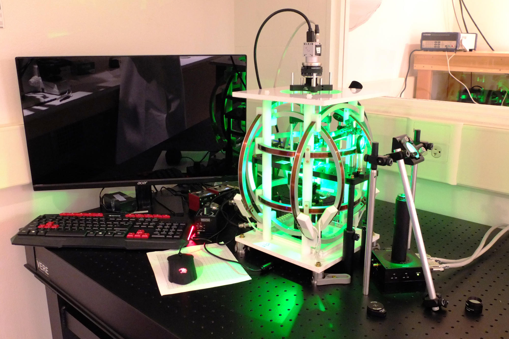
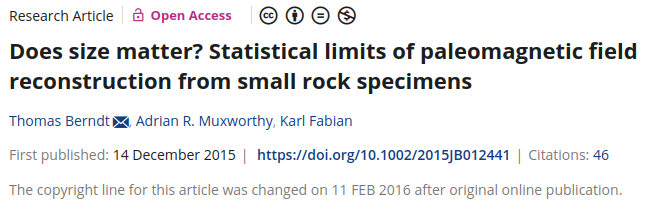
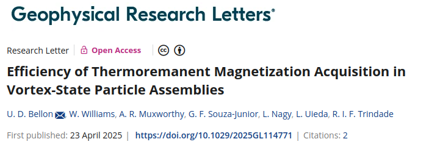
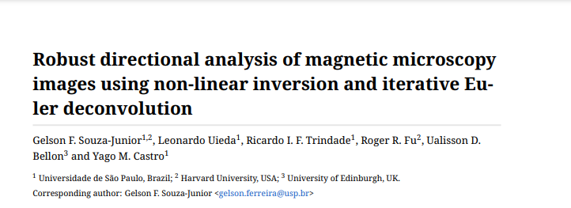
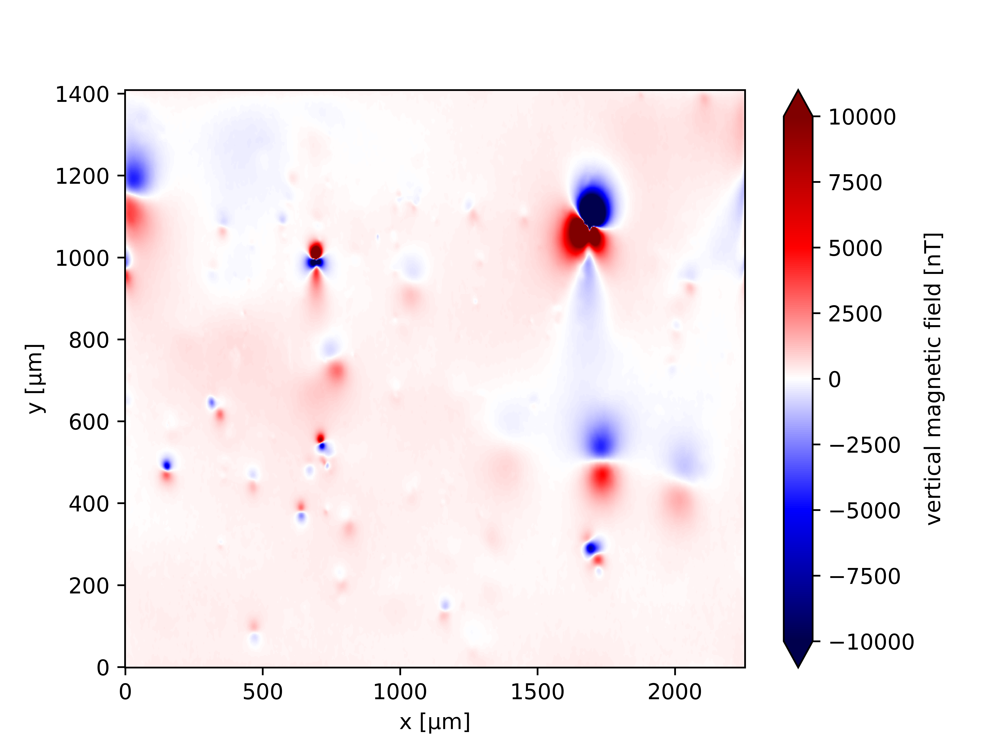
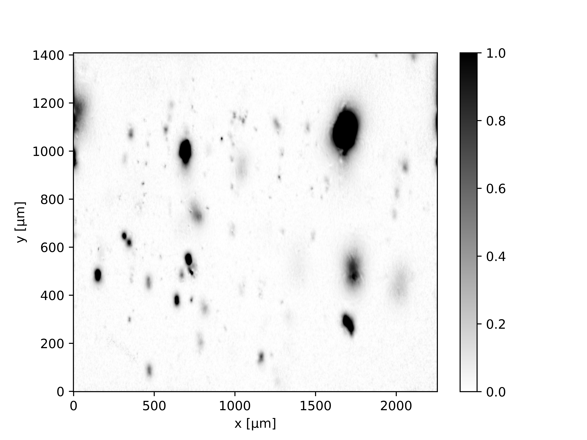

<!--
-------------------------------------------------------------------------------
This file defines the contents of each slide.
The reveal.js configuration can be found in index.html
-------------------------------------------------------------------------------
-->

<!-- .slide: class="slide-title" data-background-opacity="0.3" data-background-image="assets/magali-logo.svg" data-background-color="#000000" data-background-size="contain" -->

<!-- Place the content at the bottom of the slide -->

<h1 id="talk-title">
  
Towards an open source tool for the magnetic microscopy community 🧲🔬

</h1>

  <a id="talk-speaker"><b>Yago Moreira Castro</b></a>,
  Leonardo Uieda,
  Gelson Ferreira de Souza-Junior

<!-- Place location and date side-by-side with affiliation logos -->

<i class="fa fa-calendar-alt" style="margin: 0 10px 0 0"></i>
05 de Março  de 2025

Defesa de Mestrado em Geofísica | São Paulo, Brasil

<!-- Permission to reuse and CC-BY license logo -->
<i class="fa fa-camera" style="margin: 0 10px 0 0"></i>
Sinta-se à vontade para fotografar/compartilhar/reutilizar esta apresentação

<a href="https://creativecommons.org/licenses/by/4.0/"><i class="fab fa-creative-commons"></i><i class="fab fa-creative-commons-by" style="margin: 0 10px 0 2px"></i>CC-BY 4.0 License</a>

<!-- Add logos here. Need these wrappers to align them to the bottom right -->

  
  
  

===============================================================================
# Sumário

<ul style="list-style: none">
  <li  style="color: red !important;"><b>Paleomagnetismo</b></li>
  <li><b>Microscopia magnética</b></li>
  <li>
    <b>Métodos</b>
    <ul style="list-style: none">
      <li>Análise do Fluxo de Trabalho</li>
      <li>Fundamentação Teórica</li>
      <li>Desenvolvimento de software</li>
    </ul>
  </li>
  <li><b>Comparação de Performance e Acurácia</b></li>  
  <li><b>Demonstração em dados reais de microscopia magnética</b></li>
  <li><b>Conclusões</b></li>
</ul>

===============================================================================
# O que é Paleomagnetismo?

Definição TAUXE

===============================================================================
# Como os minerais são magnetizados?

- <!-- .element: class="fragment" -->
  **Magnetização Remanente Termal (TRM):** rochas ígneas registram o campo magnético  à medida que esfriam abaixo do ponto de Curie (ex.: magnetita pura: **580°C**)

- <!-- .element: class="fragment" -->
  **Magnetização Remanente Deposicional (DRM):** partículas magnéticas em sedimentos se alinham com o campo magnético da Terra durante a deposição em ambientes aquáticos

===============================================================================
# Por que o paleomagnetismo é importante?

- <!-- .element: class="fragment" -->
  **Reversões geomagnéticas:** mostram que o campo magnético da Terra já se inverteu muitas vezes ao longo de sua história

- <!-- .element: class="fragment" -->
  **Deriva continental e tectônica de placas:** ajudou a confirmar a teoria da deriva continental e a reconstruir as posições passadas dos continentes

- <!-- .element: class="fragment" -->
  **Datação geológica:** utilizado como ferramenta de datação relativa ao comparar registros em rochas com a escala de tempo conhecida das reversões magnéticas (magnetoestratigrafia)

- <!-- .element: class="fragment" -->
  **Reconstrução do paleocampo:** permite compreender como o campo magnético terrestre evoluiu ao longo de centenas de milhões de anos

===============================================================================
# Tipos de grãos
- Spinner
- Alternating Field (AF)
- Desmagnetização Térmica
- Vibrating Sample Magnetometer (VSM)
- Kappabridge

===============================================================================
# Métodos de medição

===============================================================================
# Problemas do Paleomagnetismo

===============================================================================

  

===============================================================================

  

===============================================================================
# Sumário

<ul style="list-style: none">
  <li><b>Paleomagnetismo</b></li>
  <li style="color: red !important;"><b>Microscopia magnética</b></li>
  <li>
    <b>Métodos</b>
    <ul style="list-style: none">
      <li>Análise do Fluxo de Trabalho</li>
      <li>Fundamentação Teórica</li>
      <li>Desenvolvimento de software</li>
    </ul>
  </li>
  <li><b>Comparação de Performance e Acurácia</b></li>  
  <li><b>Demonstração em dados reais de microscopia magnética</b></li>
  <li><b>Conclusões</b></li>
</ul>

===============================================================================
# Quantum Diamond Microscope

===============================================================================

  

 

[Harvard Paleomagnetics Lab](https://paleomag.fas.harvard.edu/laboratory)

===============================================================================
# Mapa magnético

- Não entrega os vetores de magnetização diretamente
- Componente vertical do campo magnético (bz)
- Mostrar assinatura do dipolo
- Mapa raramente tem dipolo prefeito e isolado
    - Múltiplos dipolos aglomerados e sobrepostos com intensidades diferentes
    - Ruído intrumental 
    - Variações de nível de base regionais
- Mostrar junto ao mapa de MEV
    - Relacionar MEV ao sinal do QDM

[Citação]()

===============================================================================

- Nós temos o mapa do campo ($B_z$), mas nós queremos descobrir a fonte que gerou esse campo (justificativa do problema inverso)
    - NÃO SE MEDE MAGNETIZAÇÃO
- Aproximação ao dipolo
    - Assumimos que cada grão SD pode ser tratado como um dipolo magnético
- Para cada grão devemos estimar posição (v) e momento magnético (m)

===============================================================================

<!-- .slide: class="slide-title" data-background-opacity="1" data-background-image="assets/ceramic.png"  data-background-size="contain" -->

[Souza-Junior et al 2024](https://agupubs.onlinelibrary.wiley.com/doi/10.1029/2023GC011082)

===============================================================================
# Temos um problema

===============================================================================

===============================================================================

===============================================================================
# Bellon et al. (2025)

- **Investigaram** a aquisição de TRM por milhares de partículas nanoscópicas no **estado de vórtex**

- **Simularam** o comportamento desses conjuntos sob diversas intensidades de campos magnéticos

- **Demonstraram** que o quando as partículas são afetadas com campos de maiores que **10 μT**, o paleocampo é registrado com extrema precisão (**erro angular < 1°**)

[Bellon et al. (2025)](https://agupubs.onlinelibrary.wiley.com/doi/full/10.1029/2025GL114771)

===============================================================================
# Apliccações da microscopia magnetica

===============================================================================
# Dificuldades
- Analisar cada anomalia manualmente?
- Profundidade difícil de ser estimada
- Viés humano 

===============================================================================

===============================================================================
# Souza-Junior et al. (2025)

[Souza-Junior et al. (2025)](https://eartharxiv.org/repository/view/8869/)

=
# Sumário

<ul style="list-style: none">
  <li><b>Paleomagnetismo</b></li>
  <li><b>Microscopia magnética</b></li>
  <li style="color: red !important;">
    <b>Métodos</b>
    <ul style="list-style: none">
      <li>Análise do Fluxo de Trabalho</li>
      <li>Fundamentação Teórica</li>
      <li>Desenvolvimento de software</li>
    </ul>
  </li>
  <li><b>Comparação de Performance e Acurácia</b></li>  
  <li><b>Demonstração em dados reais de microscopia magnética</b></li>
  <li><b>Conclusões</b></li>
</ul>

===============================================================================
# Análise do Fluxo de Trabalho

Apresentar fluxo de Souza-Junior

===============================================================================
# Continuação para cima

===============================================================================
# Derivadas e TGA

- Calculamos a **Amplitude do Gradiente Total (TGA)** a partir da componente vertical do campo magnético vertical ($b_z$), definida como a norma do vetor gradiente:

$$||\vec{\mathbf{\nabla}}f(x, y, z)|| = \sqrt{(\partial_x f)^2 + (\partial_y f)^2 + (\partial_z f)^2}$$

===============================================================================
# Derivadas e TGA

- **Aproximamos** as derivadas horizontais utilizando um esquema de **diferenças finitas centrais** de segunda ordem (assumindo espaçamento uniforme $\Delta x$):

$$\partial_x f(x, y, z) \approx \frac{f(x + \Delta x, y, z) - f(x - \Delta x, y, z)}{2 \Delta x}$$

$$\partial_y f(x, y, z) \approx \frac{f(x, y + \Delta y, z) - f(x , y + \Delta y, z)}{2 \Delta y}$$

- Minimizamos a amplificação de ruídos de curto comprimento de onda ao optar por **diferenças finitas** em vez da **Transformada Rápida de Fourier (FFT)** para as derivadas em $x$ e $y$

===============================================================================
# Cálculo em Z

- **Obtemos** as variações no eixo vertical ($f(z + \Delta z)$ e $f(z - \Delta z)$) aplicando **continuação para cima e para baixo** no domínio do número de onda

[Saleh et al. (2012)](https://journals.savba.sk/index.php/cgg/article/view/5158/1272)

===============================================================================
# Vantagens do TGA

<ul>
  <li class="text-left fragment"><b>Gera</b> valores estritamente positivos</li>
  <li class="text-left fragment"><b>Centraliza</b> os picos diretamente sobre as fontes magnéticas</li>
  <li class="text-left fragment"><b>Minimiza</b> a dependência da direção de magnetização original</li>
  <li class="text-left fragment"><b>Atua</b> como um <b>filtro passa-alta</b>, removendo ruídos de longo comprimento de onda</li>
</ul>

===============================================================================
# FIGURA TGA

===============================================================================
# Realce de Contraste

- **Objetivo**: reescalonar os valores de TGA para destacar sinais fracos e fortes 
- **Operação**: transformação por pixel para normalizar os dados:

\[
\text{TGA}_{\text{rescaled}} = 2 \left( \frac{\text{TGA} - v_{\min}}{v_{\max} - v_{\min}} \right) - 1
\]

<ul>
<li>$ v_{\text{min}} = 1^\text{º} $ percentil</li>
<li>$ v_{\text{max}} = 99^\text{º} $ percentil</li>
<li><b>Saída:</b> valores reescalados para o intervalo $[0, 1]$</li>
</ul>

===============================================================================

# Por que usar limites por percentil?

- <!-- .element: class="fragment" -->
  **Escalonamento robusto**  
    Ignora outliers extremos (ex.: ruído do sensor)

- <!-- .element: class="fragment" -->
  **Validação empírica**  
    Funciona bem para dados reais de microscopia magnética

- <!-- .element: class="fragment" -->
  **Faixa dinâmica**  
    Garante a visualização de sinais fracos e fortes

===============================================================================

===============================================================================

# Filtro LoG

- **Utilizamos** o algoritmo *Laplacian of Gaussian* (LoG) para identificar os picos de intensidade (centros das partículas)

===============================================================================

# Filtro LoG

- Utilizando um parâmetro de escala ($\sigma$), **suavizamos** a imagem primeiro com um kernel Gaussiano para **eliminar ruídos de alta frequência**:

$$G(x, y; \sigma) = \frac{1}{2\pi\sigma^2} e^{-\frac{x^2 + y^2}{2\sigma^2}}$$

- Aplicamos o operador **Laplaciano** (soma das derivadas de segunda ordem) para destacar zonas de **variação rápida**:

$$\nabla \cdot \nabla G(x, y; \sigma) = \frac{x^2 + y^2 - 2\sigma^2}{2\pi\sigma^4} e^{-\frac{x^2 + y^2}{2\sigma^2}}$$

===============================================================================
# Resumo

- **O Desafio:** dados reais de microscopia contêm ruídos instrumentais e pequenas variações de alta frequência que geram "falsos positivos" na detecção

- **Gaussiano:** aplicamos um filtro que atua como um "desfoque" da imagem. Ele  **"suaviza"** a imagem apaga os ruídos pequenos e preserva apenas a forma principal da imagem.

- **Laplaciano:** com o dado já limpo, calculamos a curvatura do sinal para **detectar** o seu ponto de inflexão mais agudo, identificando o centro da partícula

===============================================================================
# Deconvolução de Euler

É um método para estimar a <b>localização</b> e a <b>profundidade</b> de fontes magnéticas

  <b>Características:</b> 
  <ul class="text-left"> 
    <li class="fragment">Assume um modelo de fonte dipolar</li>
    <li class="fragment">Aplicado a cada região segmentada dos dados</li>
    <li class="fragment">Fornece uma estimativa da posição da fonte</li>
    <li class="fragment">Baseado na equação de homogeneidade de Euler</li>
  </ul>

===============================================================================
# Equação de Homogeneidade de Euler

UTILIZAR FORMA MAIS SIMPLES 
#
$$
(x - x_c)\partial_x f + (y - y_c)\partial_y f + (z - z_c)\partial_z f = (b - f)\eta
$$ 

<ul>
  <li class="fragment">$x,y,z$ : coordenadas dos dados</li>
  <li class="fragment">$x_c,y_c,z_c$ : coordenadas da fonte do campo magnético</li>
  <li class="fragment">$f$ : função homogênea (ex.: $b_z$)</li>
  <li class="fragment">$b$ : nível de base (deslocamento constante do sinal)</li>
  <li class="fragment">$\eta$ : índice estrutural</li>
</ul>

[Souza-Junior et al. 2024](https://agupubs.onlinelibrary.wiley.com/doi/10.1029/2023GC011082)

===============================================================================
# Equação de Homogeneidade de Euler

$$
(x - x_c)\partial_x f + (y - y_c)\partial_y f + (z - z_c)\partial_z f = (b - f)\eta
$$ 

 Expandimos para um modelo pseudo-paramétrico com parâmetros $x_c, y_c, z_c, b$

$$
\underbrace{x_c \partial_x f + y_c \partial_y f + z_c \partial_z f + \eta b}_\text{Paremétrica} = \underbrace{x \partial_x f + y \partial_y f + z \partial_z f + \eta f}_\text{Não-paramétrica}
$$

[Souza-Junior et al 2024](https://agupubs.onlinelibrary.wiley.com/doi/10.1029/2023GC011082)

===============================================================================
# Equação de Homogeneidade de Euler

$$
x_c \ \partial_x f + y_c \ \partial_y f + z_c \ \partial_z f + \eta b
=
x \ \partial_x f + y \ \partial_y f + z \ \partial_z f + \eta f
$$

Aplicamos a cada ponto de dado, forma-se um sistema linear $N \times 4$

\[
\underbrace{
\begin{bmatrix}
\partial_x f_1 & \partial_y f_1 & \partial_z f_1 & \eta \\
\partial_x f_2 & \partial_y f_2 & \partial_z f_2 & \eta \\
\vdots & \vdots & \vdots & \vdots \\
\partial_x f_N & \partial_y f_N & \partial_z f_N & \eta
\end{bmatrix}
}_{\text{Matriz Jacobiana}}
\underbrace{
\begin{bmatrix}
x_c \\ y_c \\ z_c \\ b
\end{bmatrix}
}_{\text{Vetor de parâmetros}}
=
\underbrace{
\begin{bmatrix}
x_1 \partial_x f_1 + y_1 \partial_y f_1 + z_1 \partial_z f_1 + \eta f_1 \\
x_2 \partial_x f_2 + y_2 \partial_y f_2 + z_2 \partial_z f_2 + \eta f_2 \\
\vdots \\
x_N \partial_x f_N + y_N \partial_y f_N + z_N \partial_z f_N + \eta f_N
\end{bmatrix}
}_{\text{Vetor de pseudodados}}
\]

$$\mathbf{Gp=h}$$

[Souza-Junior et al. 2024](https://agupubs.onlinelibrary.wiley.com/doi/10.1029/2023GC011082)

===============================================================================
# Solução por mínimos quadrados

$$
\mathbf{G} \mathbf{p} = \mathbf{h}
$$

Utilizamos uma <b>solução de mínimos quadrados</b>, cuja função objetivo é:

$$
\Phi (\mathbf{p}) = ||\mathbf{h}^o - \mathbf{h}||^2
$$

<ul>
  <li>$\Phi (\mathbf{p})$ : função objetivo</li>
  <li>$\mathbf{h}^o$ : dados observados</li>
  <li>$\mathbf{h}$ : dados preditos</li>
</ul>

===============================================================================
# Para resolver

<ol>
  <li class="fragment">
    <strong>Expandindo a expressão:</strong> 
    \[
    \Phi(\mathbf{p}) = (\mathbf{h}^o - \mathbf{G}\mathbf{p})^\top (\mathbf{h}^o - \mathbf{G}\mathbf{p}) = \underbrace{\mathbf{h}^{o\top}\mathbf{h}^o - 2\mathbf{p}^\top \mathbf{G}^\top \mathbf{h}^o + \mathbf{p}^\top \mathbf{G}^\top \mathbf{G} \mathbf{p}}_\text{Paraboloid}
    \]
  </li>
  <li class="fragment">
    <strong>Utilizamos o gradiente em respeito a \(\mathbf{p}\) and atribuímos zero:</strong> 
    \[
      \nabla_{\mathbf{p}} \Phi(\mathbf{p}) = -2 \mathbf{G}^\top \mathbf{h}^o + 2 \mathbf{G}^\top \mathbf{G} \mathbf{p}=\mathbf{0}
    \]
    \[
      \boxed{
      \mathbf{G}^\top \mathbf{G} \mathbf{p} = \mathbf{G}^\top \mathbf{h}^o
      }
    \]
  </li>
  <li class="fragment">
    <strong>Resolvemos as equações normais e estimar $x_c$, $y_c$, $z_c$ e $b$:</strong> 
  </li>
</ol>

===============================================================================
# Inversão linear
## Modelo de Campo de Dipolo

O campo $\mathbf{b}$ gerado por um dipolo $\mathbf{m} = [m_x \ m_y \ m_z]^\top$:

$$
\mathbf{b} = 
\begin{bmatrix}
b_x \\
b_y \\
b_z
\end{bmatrix}
=
\frac{\mu_0}{4\pi}
\begin{bmatrix}
\frac{\partial^2}{\partial x \partial x} \frac{1}{r} & \frac{\partial^2}{\partial x \partial y} \frac{1}{r} & \frac{\partial^2}{\partial x \partial z} \frac{1}{r} \\
\frac{\partial^2}{\partial y \partial x} \frac{1}{r} & \frac{\partial^2}{\partial y \partial y} \frac{1}{r} & \frac{\partial^2}{\partial y \partial z} \frac{1}{r} \\
\frac{\partial^2}{\partial z \partial x} \frac{1}{r} & \frac{\partial^2}{\partial z \partial y} \frac{1}{r} & \frac{\partial^2}{\partial z \partial z} \frac{1}{r}
\end{bmatrix}
\begin{bmatrix}
m_x \\
m_y \\
m_z
\end{bmatrix}
=
\frac{\mu_0}{4\pi} \mathbf{M} \mathbf{m}
$$
 

<ul>
<li> $r=\sqrt{(x-x_c)^2+(y-y_c)^2+(z-z_c)^2}$ </li>
<li> $\mu_0$ : permeabilidade magnética</li>
</ul>

===============================================================================
<h1>Sistema para $b_z$</h1>

\[
\mathbf{b} = 
\begin{bmatrix}
b_x \\
b_y \\
b_z
\end{bmatrix}
=
\frac{\mu_0}{4\pi}
\begin{bmatrix}
\frac{\partial^2}{\partial x \partial x} \frac{1}{r} & \frac{\partial^2}{\partial x \partial y} \frac{1}{r} & \frac{\partial^2}{\partial x \partial z} \frac{1}{r} \\
\frac{\partial^2}{\partial y \partial x} \frac{1}{r} & \frac{\partial^2}{\partial y \partial y} \frac{1}{r} & \frac{\partial^2}{\partial y \partial z} \frac{1}{r} \\
\frac{\partial^2}{\partial z \partial x} \frac{1}{r} & \frac{\partial^2}{\partial z \partial y} \frac{1}{r} & \frac{\partial^2}{\partial z \partial z} \frac{1}{r}
\end{bmatrix}
\begin{bmatrix}
m_x \\
m_y \\
m_z
\end{bmatrix}
=
\frac{\mu_0}{4\pi} \mathbf{M} \mathbf{m}
\]

$$
b_z = 
\frac{\mu_0}{4\pi}
\begin{bmatrix}
\frac{\partial^2}{\partial z \partial x} \frac{1}{r} & \frac{\partial^2}{\partial z \partial y} \frac{1}{r} & \frac{\partial^2}{\partial z \partial z} \frac{1}{r}
\end{bmatrix}
\begin{bmatrix}
m_x \\
m_y \\
m_z
\end{bmatrix}^\top 
$$

===============================================================================
$$
\frac{\partial^2}{\partial z \partial x} \frac{1}{r} = \frac{3(z - z_c)(x - x_c)}{r^5}
$$
$$
\frac{\partial^2}{\partial z \partial y} \frac{1}{r} = \frac{3(z - z_c)(y - y_c)}{r^5}
$$
$$
\frac{\partial^2}{\partial z \partial z} \frac{1}{r} = \frac{3(z - z_c)^2}{r^5} - \frac{1}{r^3}
$$

===============================================================================
# Formulação do Problema

Dadas $N$ observações de $b_z$ em uma janela contendo uma única fonte,
forma-se um sistema linear $N \times 3$:

\[
\underbrace{  
\begin{bmatrix}
\frac{\mu_0}{4\pi} \frac{3(z_1 - z_c)(x_1 - x_c)}{r_1^5} & \frac{\mu_0}{4\pi} \frac{3(z_1 - z_c)(y_1 - y_c)}{r_1^5} & \frac{\mu_0}{4\pi} \left( \frac{3(z_1 - z_c)^2}{r_1^5} - \frac{1}{r_1^3} \right) \\
\frac{\mu_0}{4\pi} \frac{3(z_2 - z_c)(x_2 - x_c)}{r_2^5} & \frac{\mu_0}{4\pi} \frac{3(z_2 - z_c)(y_2 - y_c)}{r_2^5} & \frac{\mu_0}{4\pi} \left( \frac{3(z_2 - z_c)^2}{r_2^5} - \frac{1}{r_2^3} \right) \\
\vdots & \vdots & \vdots \\
\frac{\mu_0}{4\pi} \frac{3(z_N - z_c)(x_N - x_c)}{r_N^5} & \frac{\mu_0}{4\pi} \frac{3(z_N - z_c)(y_N - y_c)}{r_N^5} & \frac{\mu_0}{4\pi} \left( \frac{3(z_N - z_c)^2}{r_N^5} - \frac{1}{r_N^3} \right)
\end{bmatrix}}_{\text{Jacobiana}}
\underbrace{
\begin{bmatrix}
m_x \\
m_y \\
m_z
\end{bmatrix}}_{\text{Parâmetros}}
=
\underbrace{
\begin{bmatrix}
b_{z_1} \\
b_{z_2} \\
\vdots \\
b_{z_N}
\end{bmatrix}}_{\text{Observação}}
\]

$$\mathbf{Am=d}$$

===============================================================================
# Estimativa por Mínimos Quadrados

Minimizamos a função de erro:

$$\Gamma(\mathbf{m}) = \|\mathbf{d}^{o}-\mathbf{A}\mathbf{m}\|^2=(\mathbf{d}^{o}-\mathbf{A}\mathbf{m})^T(\mathbf{d}^{o}-\mathbf{A}\mathbf{m})$$

O que leva às equações normais:

$$\mathbf{A}^T\mathbf{A}\mathbf{m} = \mathbf{A}^T\mathbf{d}^{o}$$

A solução fornece o momento de dipolo estimado ($\mathbf{m}$)

===============================================================================
# Inversão Híbrida

# DEIXAR CLARO QUE  AQUI NOSSO MÉTODO SE DIFERE DE SOUZA-JUNIOR 2025

- **Exploramos a estrutura matemática do problema:** para uma localização fixa ($\mathbf{v}$), o campo magnético **depende linearmente** do momento magnético ($\mathbf{m}$)

- Evitamos o **acoplamento direto** de parâmetros com **ordens de magnitude muito diferentes**. Em inversões simultâneas, a diferença entre a escala da localização (**10⁻⁶ m**) e do momento (**10⁻¹³ Am²**) dificulta a convergência

- Garantimos um problema **bem escalonado** ao separar a inversão em **grupos fisicamente homogêneos**, dispensando a necessidade de **normalizações** explícitas de parâmetros

===============================================================================
# Inversão Híbrida

- Implementamos uma estratégia onde a inversão linear para o momento dipolar ($\mathbf{m}$) é **aninhada** dentro da inversão não-linear de **Levenberg-Marquardt (LM)** para a localização $\mathbf{v}$

- **Atualizamos** os parâmetros em cada iteração seguindo este ciclo:

1. Fixamos uma localização de teste ($\mathbf{v}$), obtida utilizando Deconvolução de Euler

2. Estimamos o momento ($\mathbf{m}$) para aquela posição

3. Atualizamos a localização ($\mathbf{v}$) com base no gradiente do erro

===============================================================================
# Otimização via Levenberg-Marquardt

- Utilizamos a inversão de **Levenberg-Marquardt** por ser um método **baseado em gradiente**, sendo melhor optimizado quando comparado a métodos que **independem de derivadas**, como Nelder-Mead, para problemas **suaves e diferenciáveis**

- Minimizamos a função objetivo a partir do método de mínimos quadrados $\Psi(\mathbf{v})$:

$$\Psi(\mathbf{v}) = \| \mathbf{d}^o - \mathbf{d}(\mathbf{v}) \|^2$$

- $\mathbf{d}^o$ dados observados
- $\mathbf{d}(\mathbf{v})$ dados preditos

[Souza-Junior et al. (2025)](https://eartharxiv.org/repository/view/8869/)

===============================================================================
# Inversão Híbrida

- Partimos da estimativa inicial de posição $\mathbf{v}$ obtida via **Deconvolução de Euler** e realizamos uma inversão linear inicial para o momento $\mathbf{m}$.

- Atualizamos a localização resolvendo o sistema amortecido para o incremento $\Delta \mathbf{v}$:

$$\left( \mathbf{J}^T \mathbf{J} + \alpha \cdot \mathrm{diag}(\mathbf{J}^T \mathbf{J}) \right) \Delta\mathbf{v} = \mathbf{J}^T \big( \mathbf{d}^o - \mathbf{d}(\mathbf{v}) \big)$$

- $\mathbf{J}^T \mathbf{J}$: aproximação da Hessiana
- $\alpha \cdot \mathrm{diag}(\mathbf{J}^T \mathbf{J})$: amortecimento escalonado pela curvatura local
- $(\mathbf{d}^o - \mathbf{d}(\mathbf{v}))$: vetor de resíduos

===============================================================================
# Matriz Jacobiana

- Derivamos **analiticamente** o modelo direto da componente vertical do dipolo magnético para construir a matriz **Jacobiana**:

\[
\mathbf{J} =
\begin{bmatrix}
\frac{\partial b_{z,1}}{\partial x_c} & \frac{\partial b_{z,1}}{\partial y_c} & \frac{\partial b_{z,1}}{\partial z_c} \\
\frac{\partial b_{z,2}}{\partial x_c} & \frac{\partial b_{z,2}}{\partial y_c} & \frac{\partial b_{z,2}}{\partial z_c} \\
\vdots & \vdots & \vdots \\
\frac{\partial b_{z,N}}{\partial x_c} & \frac{\partial b_{z,N}}{\partial y_c} & \frac{\partial b_{z,N}}{\partial z_c}
\end{bmatrix}
\]

===============================================================================

\[
\frac{\partial b_z}{\partial x_c} =
\frac{\mu_0}{4\pi}
\Big[
m_x \left( \frac{15 \Delta z \Delta x^2}{r^7} - \frac{3 \Delta z}{r^5} \right)
+ m_y \frac{15 \Delta z \Delta y \Delta x}{r^7}
+ m_z \left( \frac{15 \Delta z^2 \Delta x}{r^7} - \frac{3 \Delta x}{r^5} \right)
\Big]
\]

\[
\frac{\partial b_z}{\partial y_c} =
\frac{\mu_0}{4\pi}
\Big[
m_x \frac{15 \Delta z \Delta x \Delta y}{r^7}
+ m_y \left( \frac{15 \Delta z \Delta y^2}{r^7} - \frac{3 \Delta z}{r^5} \right)
+ m_z \left( \frac{15 \Delta z^2 \Delta y}{r^7} - \frac{3 \Delta y}{r^5} \right)
\Big]
\]

\[
\frac{\partial b_z}{\partial z_c} =
\frac{\mu_0}{4\pi}
\Big[
m_x \left( \frac{15 \Delta x \Delta z^2}{r^7} - \frac{3 \Delta x}{r^5} \right)
+ m_y \left( \frac{15 \Delta y \Delta z^2}{r^7} - \frac{3 \Delta y}{r^5} \right)
+ m_z \left( \frac{15 \Delta z^3}{r^7} - \frac{9 \Delta z}{r^5} \right)
\Big]
\]

O uso de derivadas analíticas em vez de diferenças finitas garante **maior precisão** e **eficiência computacional** na convergência

===============================================================================
# Parâmetro de Marquardt 

- Inicializamos o **parâmetro de Marquardt ($\alpha$)** de forma não arbitrária, baseando-nos na mediana da diagonal da aproximação Hessiana para o condicionamento do sistema:

$$\alpha = S \cdot \text{median}(\text{diag}(\mathbf{J}^T\mathbf{J})) \quad \text{, } S = 10^{-20}$$

===============================================================================
$$\left( \mathbf{J}^T \mathbf{J} + \alpha \cdot \mathrm{diag}(\mathbf{J}^T \mathbf{J}) \right) \Delta\mathbf{v} = \mathbf{J}^T \big( \mathbf{d}^o - \mathbf{d}(\mathbf{v}) \big)$$

- Ajustamos $\alpha$ dinamicamente via estratégia de **região de confiança**:
  - **Redução do erro = Sucesso:** aceitamos $\Delta \mathbf{v}$ e dividimos $\alpha$ por 10 tendendo a **Gauss-Newton**
  - **Aumento do erro = Levenberg-Marquardt:** rejeitamos $\Delta \mathbf{v}$ e multiplicamos $\alpha$ por 10 tendendo a **Steepest Descent**

===============================================================================
# Estabilidade e Ciclo de Convergência

- Limitamos o deslocamento máximo por iteração ($\|\Delta \mathbf{v}\| \le 10\mu m$) para evitar atualizações que não façam sentido fisicamente e garantir que a solução permaneça dentro da janela de dados

- **Estruturamos** a convergência em dois loops:
  - **Loop Interno:** refina a posição ($\mathbf{v}$) via **Levenberg-Marquardt** com momento fixo
  - **Loop Externo:** reestima o momento ($\mathbf{m}$) via **inversão linear** com posição fixa

- Finalizamos o processo quando a **redução relativa do resíduo** atinge a tolerância de **$10^{-2}$**

===============================================================================
# Resumo

1. **Inicialização:**
   - Partimos da estimativa de Euler para a posição inicial  ($\mathbf{v}$)
   - Definimos a tolerância de convergência e inicializamos o parâmetro de Marquardt ($\alpha$) com base na curvatura da Hessiana aproximada

===============================================================================

2. **Inversão Acoplada (Loop Externo):**
   - Alternamos entre a **estimativa do momento** e o **refinamento da posição** até que a redução da função objetivo global seja **inferior à tolerância definida**

  - **A) Estimativa linear do momento:** com a posição ($\mathbf{v}$) fixa, **calculamos** analiticamente o momento ($\mathbf{m}$) via mínimos quadrados

  - **B) Atualização não-linear da posição:** com o momento ($\mathbf{m}$) fixo, **refinamos** a localização ($\mathbf{v}$) através do loop interno de Levenberg-Marquardt

  - **C) Misfit:** calculamos o dado predito e avaliamos o **misfit global**

===============================================================================

3. **Convergência:**
  - Finalizamos o algoritmo quando a melhoria entre iterações sucessivas se torna insignificante, extraindo os **vetores de posição e momento finais da fonte**

===============================================================================
# Necessidades

- Algoritmos para **detecção automática** de **grãos magnéticos** e determinação de seus **momentos magnéticos**

- **Software aberto** para **modelagem direta** e técnicas de **inversão** específicas para microscopia magnética

- **Convenções de dados**

===============================================================================
<!-- .slide: data-background-opacity="1" data-background-image="assets/readme-banner.png"  data-background-size="contain" data-background-color="#262626" -->

===============================================================================
<!-- .slide: data-background-opacity="0.2" data-background-image="assets/magali-logo.png"  data-background-size="contain" data-background-color="#262626" -->

O que é o Magali?

Biblioteca em Python  <i class="fab fa-python"></i>

Software livre e de código aberto  

<i class="fab fa-github"></i> <i class="fas fa-lock-open"></i> <i class="fab fa-osi"></i>

Modelagem e processamento de dados de microscopia magnética  
<i class="fas fa-magnet"></i> <i class="fas fa-microscope"></i>

===============================================================================
<!-- .slide: data-background-opacity="0.2" data-background-image="assets/magali-logo.png"  data-background-size="contain" data-background-color="#262626" -->
# Por que queremos desenvolvê-la?

- Fornecer um código **fácil de usar**

- Determinar as **posições espaciais** de **múltiplos** grãos

- Facilitar a criação de **dados sintéticos**

- Propor um **formato padrão de dados**

- Servir como **base** para desenvolvimento de novos métodos

- Explorar o potencial de estudos emergentes em **microscopia magnética**

===============================================================================
# Implementação de Software

- Integramos o pacote ao projeto **Fatiando a Terra**, uma iniciativa *open-source* nascida no Brasil (USP, 2008) e referência global em geofísica

- Desenvolvemos o Magali sob **Licença BSD 3** como uma solução ponta a ponta para microscopia magnética:
  - Filtragem avançada de dados
  - Detecção automática de partículas
  - Inversão acoplada
  - Modelagem direta

===============================================================================
# Arquitetura 

- Estruturamos a ferramenta de forma modular

- Aceleramos os gargalos computacionais utilizando **Numba**
  - A compilação *Just-in-Time* (JIT) e a vetorização permitem que a nossa inversão processe mapas de alta resolução com desempenho melhor

===============================================================================
# Robustez e Pipeline de CI/CD

- **Integração Contínua (CI):** implementamos um pipeline automatizado que executa nossos de **testes de unidade** a cada *commit*, assegurando **100% de cobertura** das funções presentes no pacote

- **Regressão Visual Automática:** validamos a integridade dos modelos físicos comparando os outputs gráficos **pixel a pixel**. Isso garante que atualizações no código não alterem a consistência dos resultados 

===============================================================================
# Robustez e Pipeline de CI/CD

- **Matriz de build multiplataforma:** utilizamos **GitHub Actions** para disparar rotinas de verificação em **Linux, Windows e macOS** simultaneamente, garantindo estabilidade cross-platform

- **Entrega contínua (CD):** o fluxo de trabalho será preparado para **deploy automatizado** no PyPI e conda-forge, assegurando que as melhorias cheguem ao usuário final de forma rápida e segura

===============================================================================
# Distribuição e Ciência Aberta

- **Adotamos os pilares da Ciência Aberta**: desenvolvimento transparente no GitHub, issue tracking público e documentação completa com tutoriais replicáveis

- Facilitaremos o acesso global da nossa futura **versão v0.1** através dos gerenciadores padrão da comunidade científica:
  * **PyPI** (Python Package Index)
  * **conda-forge** (ambientes reprodutíveis)

===============================================================================
<!-- .slide: data-background-opacity="1" data-background-image="assets/github.png"  data-background-size="contain" data-background-color="#262626" -->

===============================================================================
<!-- .slide: data-background-opacity="1" data-background-image="assets/github_1.png"  data-background-size="contain" data-background-color="#262626" -->

===============================================================================
<!-- .slide: data-background-opacity="1" data-background-image="assets/github_readme.png"  data-background-size="contain" data-background-color="#262626" -->

===============================================================================
<!-- .slide: data-background-opacity="1" data-background-image="assets/pull_requests.png"  data-background-size="contain" data-background-color="#262626" -->

===============================================================================
<!-- .slide: data-background-opacity="1" data-background-image="assets/pull_request_details.png"  data-background-size="contain" data-background-color="#262626" -->

===============================================================================
<!-- .slide: data-background-opacity="1" data-background-image="assets/pull_request_details_1.png"  data-background-size="contain" data-background-color="#262626" -->

===============================================================================
<!-- .slide: data-background-opacity="1" data-background-image="assets/pull_request_details_2.png"  data-background-size="contain" data-background-color="#262626" -->

===============================================================================
<!-- .slide: data-background-opacity="1" data-background-image="assets/checks.png"  data-background-size="contain" data-background-color="#262626" -->

===============================================================================
# Sumário

<ul style="list-style: none">
  <li><b>Paleomagnetismo</b></li>
  <li><b>Microscopia magnética</b></li>
  <li>
    <b>Métodos</b>
    <ul style="list-style: none">
      <li>Análise do Fluxo de Trabalho</li>
      <li>Fundamentação Teórica</li>
      <li>Desenvolvimento de software</li>
    </ul>
  </li>
  <li style="color: red !important;"><b>Comparação de Performance e Acurácia</b></li>  
  <li><b>Demonstração em dados reais de microscopia magnética</b></li>
  <li><b>Conclusões</b></li>
</ul>

===============================================================================

- Avaliamos o **Magali** contra o algoritmo de inversão não-linear de **Souza-Junior et al. (2025)**.

- Definimos dois cenários sintéticos com diferentes resoluções de malha ($\Delta \in [0.3, 2.0]~\mu\text{m}$):
  1. **Modelo "Simple":** Um único dipolo isolado
  2. **Modelo "1-Interf.":** Um dipolo alvo + uma fonte interferente próxima

- **Garantimos condições justas:** ambos os métodos partem da mesma estimativa inicial via Deconvolução de Euler ($\eta=3$) e o nível de base é previamente removido

===============================================================================
# Métricas de Avaliação

- **Quantificamos** o desempenho em função do número de pontos de dados ($N$) realizando **5 inversões independentes** por resolução para obter médias estáveis

- Analisamos quatro pilares fundamentais:
  * **Tempo de Execução:** custo computacional médio
  * **Erro de Localização ($E_r$):** distância euclidiana entre a posição real e a estimada
  * **Erro de Intensidade ($E_I$):** diferença na magnitude do momento magnético
  * **Erro Angular ($\theta$):** desvio de orientação (direção) entre o vetor real e o recuperado

===============================================================================
# SEPARAR A COMPARAÇÃO EM DIVERSOS SLIDES

===============================================================================
<!-- .slide: data-background-opacity="1" data-background-image="assets/comparison_result.png"  data-background-size="contain" data-background-color="#262626" -->

===============================================================================
# Sumário

<ul style="list-style: none">
  <li><b>Paleomagnetismo</b></li>
  <li><b>Microscopia magnética</b></li>
  <li>
    <b>Métodos</b>
    <ul style="list-style: none">
      <li>Análise do Fluxo de Trabalho</li>
      <li>Fundamentação Teórica</li>
      <li>Desenvolvimento de software</li>
    </ul>
  </li>
  <li><b>Comparação de Performance e Acurácia</b></li>  
  <li  style="color: red !important;"><b>Demonstração em dados reais de microscopia magnética</b></li>
  <li><b>Conclusões</b></li>
</ul>

===============================================================================
# Aplicação em Dados Reais

- Demonstramos a robustez do Magali aplicando-o a três conjuntos independentes de dados reais com diferentes características:

  1. **Espeleotema (Caverna Wintimdouine):** sinal fraco, poucas partículas

  2. **Cerâmica Arqueológica:** densidade moderada, partículas SD-PSD estáveis com claro sinal dipolar

  3. **Basalto:** alta densidade, partículas muito próximas com forte contribuição multidomínio (cenário de altíssima complexidade)

- Todo o processamento foi realizado com **menos de 50 linhas** de código

===============================================================================

<section>

<pre class="compact"><code class="python" data-trim data-noescape>

import magali as mg
import numpy as np
import matplotlib.pyplot as plt
import skimage.exposure
import ensaio
import harmonica as hm

data_paths = {
    # Use the Ensaio package to fetch the speleothem dataset from the internet
    "speleothem": ensaio.fetch_morroco_speleothem_qdm(
        version=1,
        file_format="matlab",
    ),
    "ceramic": "data/ceramic/NRM1.mat",
    "basalt": "data/basalt/NRM1.mat",
}
</code></pre>
</section>

===============================================================================

<section>

<pre class="compact"><code class="python" data-trim data-noescape>

# Repeat the processing for each dataset but using slightly different parameters
size_ranges = {"speleothem": [20, 150], "ceramic": [10, 150], "basalt": [10, 30]}
detection_thresholds = {"speleothem": 0.02, "ceramic": 0.02, "basalt": 0.002}
datasets, locations, dipole_moments, bounding_boxes = {}, {}, {}, {}
</code></pre>
</section>

===============================================================================

<section>

<pre class="compact"><code class="python" data-trim data-noescape>

for name in ["speleothem", "ceramic", "basalt"]:
    # Use Magali to load the data from Harvard's QDM Matlab file format
    datasets[name] = mg.read_qdm_harvard(data_paths[name])
    # Upward continue the data by 5 microns using the Harmonica package
    height_difference = 5
    data_up = (
        hm.upward_continuation(datasets[name], height_difference)
        .assign_attrs(datasets[name].attrs)
        .assign_coords(x=datasets[name].x, y=datasets[name].y)
        .assign_coords(z=datasets[name].z + height_difference)
        .rename("bz")
    )
    # Calculate data derivatives and TGA
    data_tga = mg.total_gradient_amplitude_grid(data_up)
    # Stretch the TGA contrast to highlight weak sources
    data_stretched = skimage.exposure.rescale_intensity(
        data_tga,
        in_range=tuple(np.percentile(data_tga, (1, 99))),
    )
</code></pre>
</section>

===============================================================================
<section>

<pre class="compact"><code class="python" data-trim data-noescape>

    # Use the LoG to detect the sources in the stretched TGA
    bounding_boxes[name] = mg.detect_anomalies(
        data_stretched,
        size_range=size_ranges[name],  # μm
        detection_threshold=detection_thresholds[name],
        border_exclusion=2,
    )
    # Run the non-linear inversion to estimate dipole moments and locations
    results = mg.iterative_nonlinear_inversion(
        data_up, bounding_boxes[name], copy_data=True
    )
    locations[name] = results[1]
    dipole_moments[name] = results[2]
</code></pre>
</section>

===============================================================================

O processamento automatizado identificou com sucesso:
  - **57 fontes** no Espeleotema
  - **397 fontes** na Cerâmica
  - **661 fontes** no Basalto

===============================================================================
# SEPARAR EXEMPLO EM 3 SLIDES

===============================================================================
<!-- .slide: data-background-image="assets/example_result.png"  data-background-size="contain" data-background-color="#262626" -->

===============================================================================
# Sumário

<ul style="list-style: none">
  <li><b>Paleomagnetismo</b></li>
  <li><b>Microscopia magnética</b></li>
  <li>
    <b>Métodos</b>
    <ul style="list-style: none">
      <li>Análise do Fluxo de Trabalho</li>
      <li>Fundamentação Teórica</li>
      <li>Desenvolvimento de software</li>
    </ul>
  </li>
  <li><b>Comparação de Performance e Acurácia</b></li>  
  <li><b>Demonstração em dados reais de microscopia magnética</b></li>
  <li style="color: red !important;"><b>Conclusões</b></li>
</ul>

===============================================================================
# Contribuições Metodológicas

- Consolidamos um **fluxo completo de inversão** (detecção, Euler e refinamento) em um pacote unificado, extensível e de código aberto

- Otimizamos a inversão não-linear através da **estratégia híbrida** com o algoritmo de **Levenberg-Marquardt**, utilizando derivadas analíticas do modelo direto

- Eliminamos problemas de escalonamento numérico e instabilidade ao **desacoplar os parâmetros** de momento dipolar (linear) e posição (não-linear)

===============================================================================
# Benchmarking

- Alcançamos **ganhos de eficiência superiores a 90%** em comparação ao método de referência (Souza-Junior et al., 2025). O tempo de execução mostrou-se **insensível à densidade de dados**, mantendo-se em níveis **abaixo de 1 segundo**

- Elevamos a **precisão** em cenários complexos (fontes interferentes):
  * Redução de **60% no erro angular** para o modelo simples
  * Redução de **40% no erro angular** no caso de fonte interferente

===============================================================================
# Ciência Aberta

- **Democratizaremos** o acesso a ferramentas de ponta para a comunidade de paleomagnetistas, reduzindo barreiras técnicas via **PyPI** e **conda-forge**

- **Estabelecemos** um padrão de reprodutibilidade seguindo os princípios **FAIR** (**F**indable, **A**ccessible, **I**nteroperable, **R**eusable), integrado ao ecossistema **Fatiando a Terra**

- **Mitigamos** o isolamento metodológico através de desenvolvimento transparente, testes automatizados e documentação para novos usuários e pesquisadores avançados

===============================================================================
# Limitações

# FOCAR NAS LIMITAÇÕES DO SOFTWARE, NÃO NAS METODOLÓGICAS

- O método pressupõe **aproximações dipolares** e **isolamento via janelamento**

- Fontes **fortemente não-dipolares** ou **clusters** densos ainda são desafios para o método

===============================================================================
# Trabalhos Futuros

- Projetamos para o futuro do Magali:

  

  - Implementação de **expansão multipolar**

  

  

  - Módulos de **projeção estereográfica** e **filtragem** de inversão

  

  

  - Rotinas avançadas para **detecção automática** de fontes

  

  

  - Incluir Magali no **conda-forge** e **PyPi**

  

===============================================================================

**Magali** une **rigor matemático** e **ciência aberta** para consolidar o **paleomagnetismo de escala de grão** como uma técnica rápida, acessível e totalmente reproduzível

===============================================================================
# Agradecimentos

===============================================================================
<!-- .slide: data-background-opacity="0.2" data-background-image="assets/magali-logo.png"  data-background-size="contain" data-background-color="#262626" -->
# Obrigado!

<i class="fas fa-comments"></i>
 
Contato:
<a>yagomcastro1@gmail.com</a>

<i class="fab fa-github"></i>
 
Código-fonte desta apresentação:
 
[github.com/yagomcastro/msc-presentation](https://github.com/yagomcastro/msc-presentation)

<i class="fab fa-creative-commons"></i><i class="fab fa-creative-commons-by"></i>
 
O conteúdo desta apresentação está licenciado sob a
 
[Creative Commons Attribution 4.0 International License](https://creativecommons.org/licenses/by/4.0/)

[github.com/fatiando/magali](https://github.com/fatiando/magali)

