<!--
-------------------------------------------------------------------------------
This file defines the contents of each slide.
The reveal.js configuration can be found in index.html
-------------------------------------------------------------------------------
-->

<!-- .slide: class="slide-title" data-background-opacity="0.3" data-background-image="assets/magali-logo.svg" data-background-color="#000000" data-background-size="contain" -->

<!-- Place the content at the bottom of the slide -->

<h1 id="talk-title">
  
Magali: uma ferramenta aberta para a comunidade de microscopia
magnética🧲🔬

</h1>

  <a id="talk-speaker"><b>Yago Moreira Castro</b></a>,
  Leonardo Uieda

<!-- Place location and date side-by-side with affiliation logos -->

<i class="fa fa-calendar-alt" style="margin: 0 10px 0 0"></i>
05 de Março  de 2025

Defesa de Mestrado em Geofísica | São Paulo, Brasil

<!-- Permission to reuse and CC-BY license logo -->
<i class="fa fa-camera" style="margin: 0 10px 0 0"></i>
Sinta-se à vontade para fotografar/compartilhar/reutilizar esta apresentação

<a href="https://creativecommons.org/licenses/by/4.0/"><i class="fab fa-creative-commons"></i><i class="fab fa-creative-commons-by" style="margin: 0 10px 0 2px"></i>CC-BY 4.0 License</a>

<!-- Add logos here. Need these wrappers to align them to the bottom right -->

  
  
  

===============================================================================
# Sumário
<ul style="list-style: none">
  <li  style="color: red !important;"><b>Paleomagnetismo</b></li>
  <li><b>Microscopia magnética</b></li>
  <li>
    <b>Métodos</b>
    <ul style="list-style: none">
      <li>Fundamentação Teórica</li>
      <li>Desenvolvimento de software</li>
    </ul>
  </li>
  <li><b>Comparação de Performance e Acurácia</b></li>  
  <li><b>Demonstração em dados reais de microscopia magnética</b></li>
  <li><b>Conclusões</b></li>
</ul>

===============================================================================
# O que é Paleomagnetismo?

Aplicação de medições magnéticas de minerais de rochas para resolver problemas geológicos

[Notas de aula de Lisa Tauxe](https://magician.ucsd.edu/SIO247/)

===============================================================================
# Como os minerais são magnetizados?

- <!-- .element: class="fragment" -->
  **Magnetização Remanente Termal (TRM):** rochas ígneas registram o campo magnético  à medida que esfriam abaixo do ponto de Curie (ex.: magnetita pura: **580°C**)

- <!-- .element: class="fragment" -->
  **Magnetização Remanente Deposicional (DRM):** partículas magnéticas em sedimentos se alinham com o campo magnético da Terra durante a deposição em ambientes aquáticos

===============================================================================
# Por que o paleomagnetismo é importante?

- <!-- .element: class="fragment" -->
  **Reversões geomagnéticas:** mostram que o campo magnético da Terra já se inverteu muitas vezes ao longo de sua história

- <!-- .element: class="fragment" -->
  **Deriva continental e tectônica de placas:** ajudou a confirmar a teoria da deriva continental e a reconstruir as posições passadas dos continentes

- <!-- .element: class="fragment" -->
  **Datação geológica:** utilizado como ferramenta de datação relativa ao comparar registros em rochas com a escala de tempo conhecida das reversões magnéticas (magnetoestratigrafia)

- <!-- .element: class="fragment" -->
  **Reconstrução do paleocampo:** permite compreender como o campo magnético terrestre evoluiu ao longo de centenas de milhões de anos

===============================================================================
# Tipos de Grãos Magnéticos

- **Multidomínio (MD):** são grãos maiores que se subdividem em vários domínios, cada uma apontando em direções diferentes. Isto reduz a estabilidade magnética, tornando-os registradores pouco confiáveis

- **Domínio Único (SD):** são grãos pequenos em que a magnetização permanece uniforme e alinhada em uma única direção, apresentando altíssima estabilidade

- **Pseudo-Domínio Único (PSD):** apresentam tamanhos intermediários, podem registrar o campo magnético com elevada fidelidade e estabilidade, contrariando interpretações mais antigas que os consideravam menos confiáveis

===============================================================================
# Limitações do Paleomagnetismo

- Sobreposição com **magnetizações secundárias** e impossibilidade de **separar o sinal** de minerais diferentes (ex: magnetita vs. hematita)

- Amostras com **sinais muito fracos** não superam o ruído de fundo dos magnetômetros convencionais

- Diversos métodos **alteram a amostra**, seja alterando a magnetização ou destruindo-a

===============================================================================

  

===============================================================================

  

===============================================================================
# Sumário

<ul style="list-style: none">
  <li><b>Paleomagnetismo</b></li>
  <li style="color: red !important;"><b>Microscopia magnética</b></li>
  <li>
    <b>Métodos</b>
    <ul style="list-style: none">
      <li>Fundamentação Teórica</li>
      <li>Desenvolvimento de software</li>
    </ul>
  </li>
  <li><b>Comparação de Performance e Acurácia</b></li>  
  <li><b>Demonstração em dados reais de microscopia magnética</b></li>
  <li><b>Conclusões</b></li>
</ul>

===============================================================================
# Quantum Diamond Microscope

- Utiliza uma placa de diamante sintético com defeitos cristalinos chamados **Centros Nitrogênio-Vacância (NV)**

- Ao receber um laser verde e micro-ondas, os centros NV emitem uma luz vermelha. A **intensidade dessa fluorescência** é alterada de acordo com o **campo magnético** da rocha próxima ao diamante

- Uma câmera captura essa luz e gera um **mapa do campo magnético** da superfície medida com resolução espacial **micrométrica**

- Diferente de sensores criogênicos, o QDM opera em **temperatura ambiente**, simplificando a **logística laboratorial**

===============================================================================

  

 

[Harvard Paleomagnetics Lab](https://paleomag.fas.harvard.edu/laboratory)

===============================================================================

<!-- .slide: class="slide-title" data-background-opacity="1" data-background-image="assets/ceramic.png"  data-background-size="contain" -->

[Souza-Junior et al 2025](https://eartharxiv.org/repository/view/8869/)

===============================================================================
# Temos um problema

===============================================================================
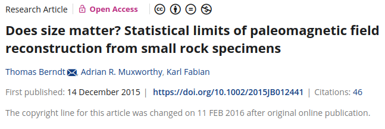

- $10^7$ a $10^9$ de grãos seriam necessários para uma rocha obter direções confiáveis

===============================================================================

===============================================================================
# Bellon et al. (2025)

- **Investigaram** a aquisição de TRM por milhares de partículas nanoscópicas no **estado de vórtex**

- **Simularam** o comportamento desses conjuntos sob diversas intensidades de campos magnéticos

- **Demonstraram** que o quando as partículas são afetadas com campos de maiores que **10 μT**, o paleocampo é registrado com extrema precisão (**erro angular < 1°**)

[Bellon et al. (2025)](https://agupubs.onlinelibrary.wiley.com/doi/full/10.1029/2025GL114771)

===============================================================================

<!-- .slide: class="slide-title" data-background-opacity="1" data-background-image="assets/ceramic.png"  data-background-size="contain" -->

[Souza-Junior et al 2025](https://eartharxiv.org/repository/view/8869/)

===============================================================================
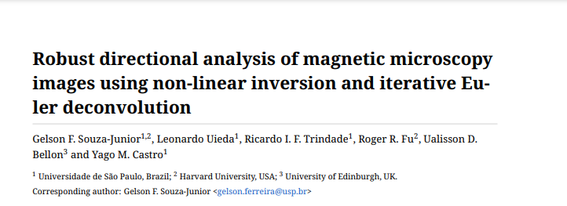

===============================================================================

  <b>Etapa 1 - Detecção da fonte</b>

  <b>Etapa 2 - Processamento iterativo (por janela)</b>

<ul>
  <li class="text-left fragment" data-fragment-index="2">
    (a) <b>Isolamento dos dados:</b> selecionar os dados magnéticos dentro da janela
  </li>
  <li class="text-left fragment" data-fragment-index="3">
    (b) <b>Deconvolução de Euler:</b> estimar a <em>posição</em> da fonte
  </li>
  <li class="text-left fragment" data-fragment-index="4">
    (c) <b>Inversão linear:</b> estimar o <em>momento</em> do dipolo usando posição fixa
  </li>
  <li class="text-left fragment" data-fragment-index="5">
    (d) <b>Inversão não linear:</b> refinar posição e momento via 
    <a href="https://academic.oup.com/comjnl/article-abstract/7/4/308/354237?redirectedFrom=fulltext">Nelder-Mead</a>
  </li>
  <li class="text-left fragment" data-fragment-index="7">
    (e) <b>Remoção do sinal:</b> modelar o dipolo diretamente e subtrair do conjunto de dados completo
  </li>
</ul>

  <b>Etapa 3 - Repetir a detecção nos dados residuais:</b>
  aplicar as etapas 1 e 2 ao conjunto de dados residual

===============================================================================
<!-- .slide: data-background-opacity="1" data-background-image="assets/readme-banner.png"  data-background-size="contain" data-background-color="#262626" -->

===============================================================================
<!-- .slide: data-background-opacity="0.2" data-background-image="assets/magali-logo.png"  data-background-size="contain" data-background-color="#262626" -->

O que é o Magali?

Biblioteca em Python  <i class="fab fa-python"></i>

Software livre e de código aberto  

<i class="fab fa-github"></i> <i class="fas fa-lock-open"></i> <i class="fab fa-osi"></i>

Modelagem e processamento de dados de microscopia magnética  
<i class="fas fa-magnet"></i> <i class="fas fa-microscope"></i>

===============================================================================
<!-- .slide: data-background-opacity="0.2" data-background-image="assets/magali-logo.png"  data-background-size="contain" data-background-color="#262626" -->

# Por que queremos desenvolvê-la?

- Fornecer um código **fácil de usar**

- Determinar as **posições espaciais** de **múltiplos** grãos

- Facilitar a criação de **dados sintéticos**

- Propor um **formato padrão de dados**

- Servir como **base** para desenvolvimento de novos métodos

- Explorar o potencial de estudos emergentes em **microscopia magnética**

===============================================================================
# Sumário
<ul style="list-style: none">
  <li><b>Paleomagnetismo</b></li>
  <li><b>Microscopia magnética</b></li>
  <li style="color: red !important;">
    <b>Métodos</b>
    <ul style="list-style: none">
      <li>Fundamentação Teórica</li>
      <li>Desenvolvimento de software</li>
    </ul>
  </li>
  <li><b>Comparação de Performance e Acurácia</b></li>  
  <li><b>Demonstração em dados reais de microscopia magnética</b></li>
  <li><b>Conclusões</b></li>
</ul>

===============================================================================
<h2>Etapa 1: Detecção da Fonte</h2>
  

  <b>Objetivo:</b> isolar cada partícula magnética na imagem

  <b>Métodos utilizados:</b>

<ul>
  <li class="fragment">
    <b>Continuação para cima:</b> atenua ruídos de alta frequência (filtro passa-baixa) e estabiliza o campo para o cálculo de gradientes 
  </li>
  <li class="fragment">
    <b>Amplitude do Gradiente Total (TGA):</b> realça o sinal próximo à fonte através de um filtro passa-alta
  </li>
  <li class="fragment">
    <b>Realce de contraste:</b> utiliza percentis (1º e 99º) para destacar partículas de baixa intensidade
  </li>
  <li class="fragment">
    <b>Segmentação LoG (Laplaciano do Gaussiano):</b> detecta “blobs” e define uma janela individual por partícula e as organiza por intensidade de sinal decrescente para o processamento iterativo
  </li>
</ul>

===============================================================================
# Continuação para cima
## Filtro no domínio da frequência

$$F(k,\Delta z)=F(k,0) \cdot e^{-\Delta z |k|}$$

- **Como funciona:** atenua o sinal conforme a altura

- **Suaviza ruídos** sem inventar dados

  - Prepara o sinal para o **cálculo de derivadas**

[Blakely (1995)](https://www.cambridge.org/core/books/potential-theory-in-gravity-and-magnetic-applications/348880F23008E16E663D6AD14A41D8DE)

===============================================================================

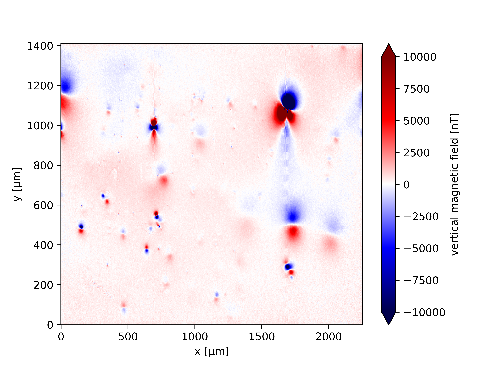

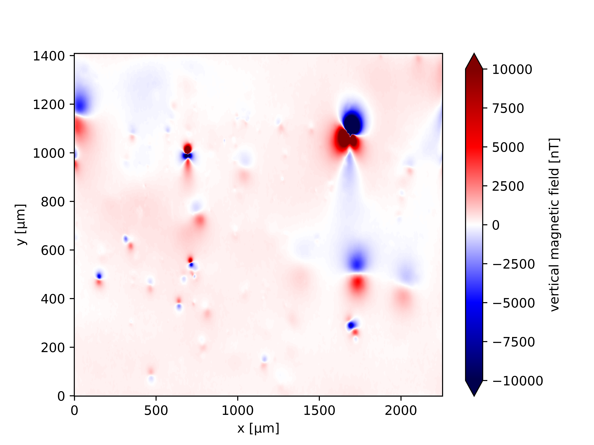

Continuação para cima de $5 \mu m$

===============================================================================
<h2>Etapa 1: Detecção da Fonte</h2>
  

  <b>Objetivo:</b> isolar cada partícula magnética na imagem

  <b>Métodos utilizados:</b>

<ul>
  <li >
    <b>Continuação para cima:</b> atenua ruídos de alta frequência (filtro passa-baixa) e estabiliza o campo para o cálculo de gradientes 
  </li>
  <li style="color: red !important;">
    <b>Amplitude do Gradiente Total (TGA):</b> realça o sinal próximo à fonte através de um filtro passa-alta
  </li>
  <li>
    <b>Realce de contraste:</b> utiliza percentis (1º e 99º) para destacar partículas de baixa intensidade
  </li>
  <li>
    <b>Segmentação LoG (Laplaciano do Gaussiano):</b> detecta “blobs” e define uma janela individual por partícula e as organiza por intensidade de sinal decrescente para o processamento iterativo
  </li>
</ul>

===============================================================================
# Derivadas e TGA

- Calcula-se a **Amplitude do Gradiente Total (TGA)** de uma função harmônica (podendo ser o campo magnético) definida como a norma do vetor gradiente:

$$||\vec{\mathbf{\nabla}}f(x, y, z)|| = \sqrt{(\partial_x f)^2 + (\partial_y f)^2 + (\partial_z f)^2}$$

[Blakely (1995)](https://www.cambridge.org/core/books/potential-theory-in-gravity-and-magnetic-applications/348880F23008E16E663D6AD14A41D8DE)

===============================================================================
# Derivadas e TGA

- No dado continuado para cima, **aproximam-se** as derivadas horizontais utilizando um esquema de **diferenças finitas centrais** de segunda ordem (assumindo espaçamento uniforme $\Delta x$ e $\Delta y$):

$$\partial_x f(x, y, z) \approx \frac{f(x + \Delta x, y, z) - f(x - \Delta x, y, z)}{2 \Delta x}$$

$$\partial_y f(x, y, z) \approx \frac{f(x, y + \Delta y, z) - f(x , y + \Delta y, z)}{2 \Delta y}$$

===============================================================================
# Cálculo em Z

- **Obtem-se** as variações no eixo vertical ($f(z + \Delta z)$ e $f(z - \Delta z)$) aplicando **continuação para cima** no dado original a uma altura abaixo e uma acima do anteriormente continuado

[Souza-Junior et al. (2025)](https://eartharxiv.org/repository/view/8869/)

===============================================================================
# Vantagens do TGA
<ul>
  <li class="text-left fragment"><b>Gera</b> valores estritamente positivos</li>
  <li class="text-left fragment"><b>Centraliza</b> os picos diretamente sobre as fontes magnéticas</li>
  <li class="text-left fragment"><b>Minimiza</b> a dependência da direção de magnetização original</li>
  <li class="text-left fragment"><b>Atua</b> como um <b>filtro passa-alta</b>, removendo ruídos de longo comprimento de onda</li>
</ul>

===============================================================================

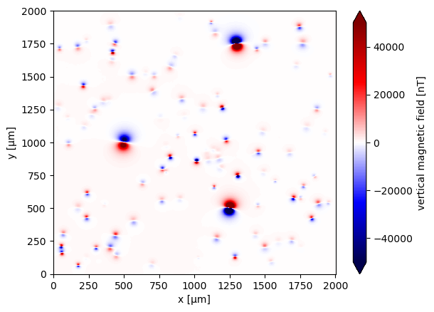

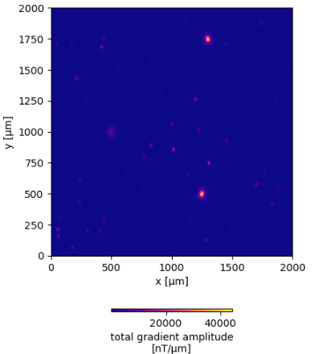

SUBSTITUIR PELO DADO REAL

===============================================================================
<h2>Etapa 1: Detecção da Fonte</h2>
  

  <b>Objetivo:</b> isolar cada partícula magnética na imagem

  <b>Métodos utilizados:</b>

<ul>
  <li >
    <b>Continuação para cima:</b> atenua ruídos de alta frequência (filtro passa-baixa) e estabiliza o campo para o cálculo de gradientes 
  </li>
  <li>
    <b>Amplitude do Gradiente Total (TGA):</b> realça o sinal próximo à fonte através de um filtro passa-alta
  </li>
  <li style="color: red !important;">
    <b>Realce de contraste:</b> utiliza percentis (1º e 99º) para destacar partículas de baixa intensidade
  </li>
  <li>
    <b>Segmentação LoG (Laplaciano do Gaussiano):</b> detecta “blobs” e define uma janela individual por partícula e as organiza por intensidade de sinal decrescente para o processamento iterativo
  </li>
</ul>

===============================================================================
# Realce de Contraste

- **Objetivo**: reescalonar os valores de TGA para destacar sinais fracos e fortes 
- **Operação**: transformação por pixel para normalizar os dados:

\[
\text{TGA}_{\text{rescaled}} = 2 \left( \frac{\text{TGA} - v_{\min}}{v_{\max} - v_{\min}} \right) - 1
\]

<ul>
<li>$ v_{\text{min}} = 1^\text{º} $ percentil</li>
<li>$ v_{\text{max}} = 99^\text{º} $ percentil</li>
<li><b>Saída:</b> valores reescalados para o intervalo $[0, 1]$</li>
</ul>

===============================================================================

===============================================================================
<h2>Etapa 1: Detecção da Fonte</h2>

  <b>Objetivo:</b> isolar cada partícula magnética na imagem

  <b>Métodos utilizados:</b>

<ul>
  <li >
    <b>Continuação para cima:</b> atenua ruídos de alta frequência (filtro passa-baixa) e estabiliza o campo para o cálculo de gradientes 
  </li>
  <li>
    <b>Amplitude do Gradiente Total (TGA):</b> realça o sinal próximo à fonte através de um filtro passa-alta
  </li>
  <li>
    <b>Realce de contraste:</b> utiliza percentis (1º e 99º) para destacar partículas de baixa intensidade
  </li>
  <li style="color: red !important;">
    <b>Segmentação LoG (Laplaciano do Gaussiano):</b> detecta “blobs” e define uma janela individual por partícula e as organiza por intensidade de sinal decrescente para o processamento iterativo
  </li>
</ul>

===============================================================================
# Filtro LoG

- **Utiliza-se** o algoritmo Laplaciano do Gaussiano (LoG) para identificar os picos de intensidade (centros das partículas)

===============================================================================
# Filtro LoG

- Utiliza-se um parâmetro de escala ($\sigma$), **suavizamos** a imagem primeiro com um kernel Gaussiano para **eliminar ruídos de alta frequência**:

$$G(x, y; \sigma) = \frac{1}{2\pi\sigma^2} e^{-\frac{x^2 + y^2}{2\sigma^2}}$$

**Kernel** funciona como um filtro que é convolvido com a imagem

- Aplicamos o operador **Laplaciano** (soma das derivadas de segunda ordem) para destacar zonas de **variação rápida**:

$$\nabla \cdot \nabla G(x, y; \sigma) = \frac{x^2 + y^2 - 2\sigma^2}{2\pi\sigma^4} e^{-\frac{x^2 + y^2}{2\sigma^2}}$$

===============================================================================

  

    
  

  

    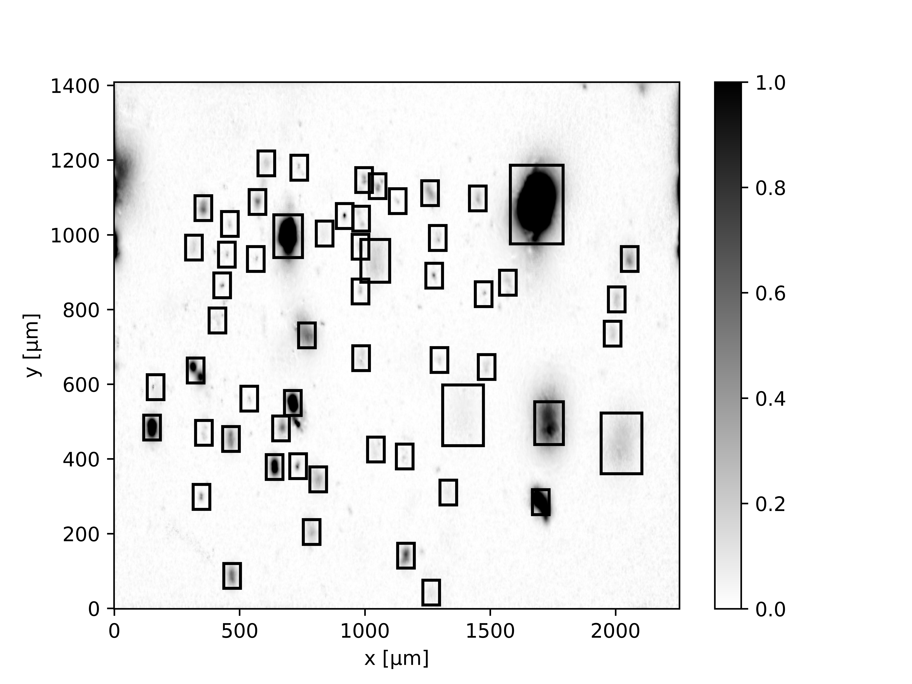
  

===============================================================================
# Deconvolução de Euler

É um método baseado na equação de homogeneidade de Euler para estimar a <b>localização</b> e a <b>profundidade</b> de fontes magnéticas

 

Para este método assume-se um modelo de fonte dipolar</li>

===============================================================================
# Equação de Homogeneidade de Euler

$$
(\mathbf{x}-\mathbf{v})\cdot \nabla f = (b-f)\eta
$$

<ul>
  <li class="fragment">$\mathbf{x}=[x,y,z]^T$ : coordenadas dos dados</li>
  <li class="fragment">$\mathbf{v}=[x_c,y_c,z_c]^T$ : coordenadas da fonte do campo magnético</li>
  <li class="fragment">$f$ : função homogênea (ex.: $b_z$)</li>
  <li class="fragment">$b$ : nível de base (deslocamento constante do sinal)</li>
  <li class="fragment">$\eta$ : índice estrutural ($\eta=3$ para dipolos)</li>
</ul>

[Reid et al. 1990](https://pubs.geoscienceworld.org/seg/geophysics/article-abstract/55/1/80/72314/Magnetic-interpretation-in-three-dimensions-using?redirectedFrom=fulltext)

===============================================================================
# Equação de Homogeneidade de Euler

$$
(\mathbf{x}-\mathbf{v})\cdot \nabla f = (b-f)\eta
$$

A taxa de **variação do campo** ($\nabla f$) multiplicada pela **distância vetorial** ($\mathbf{x}-\mathbf{v}$) é proporcional à **amplitude do campo medido** ($b-f$)

[Reid et al. 1990](https://pubs.geoscienceworld.org/seg/geophysics/article-abstract/55/1/80/72314/Magnetic-interpretation-in-three-dimensions-using?redirectedFrom=fulltext)

===============================================================================
# Equação de Homogeneidade de Euler

$$
(x - x_c)\partial_x f + (y - y_c)\partial_y f + (z - z_c)\partial_z f = (b - f)\eta
$$ 

 Isolando os parâmetros parâmetros $x_c, y_c, z_c, b$

$$
\underbrace{x_c \partial_x f + y_c \partial_y f + z_c \partial_z f + \eta b}_\text{Com parâmetros} = \underbrace{x \partial_x f + y \partial_y f + z \partial_z f + \eta f}_\text{Sem parâmetros}
$$

[Reid et al. 1990](https://pubs.geoscienceworld.org/seg/geophysics/article-abstract/55/1/80/72314/Magnetic-interpretation-in-three-dimensions-using?redirectedFrom=fulltext)
[Souza-Junior et al. 2024](https://agupubs.onlinelibrary.wiley.com/doi/10.1029/2023GC011082)

===============================================================================
# Equação de Homogeneidade de Euler

$$
x_c \ \partial_x f + y_c \ \partial_y f + z_c \ \partial_z f + \eta b
=
x \ \partial_x f + y \ \partial_y f + z \ \partial_z f + \eta f
$$

Aplicamos a cada ponto de dado, forma-se um sistema linear $N \times 4$

\[
\underbrace{
\begin{bmatrix}
\partial_x f_1 & \partial_y f_1 & \partial_z f_1 & \eta \\
\partial_x f_2 & \partial_y f_2 & \partial_z f_2 & \eta \\
\vdots & \vdots & \vdots & \vdots \\
\partial_x f_N & \partial_y f_N & \partial_z f_N & \eta
\end{bmatrix}
}_{\text{Matriz Jacobiana}}
\underbrace{
\begin{bmatrix}
x_c \\ y_c \\ z_c \\ b
\end{bmatrix}
}_{\text{Vetor de parâmetros}}
=
\underbrace{
\begin{bmatrix}
x_1 \partial_x f_1 + y_1 \partial_y f_1 + z_1 \partial_z f_1 + \eta f_1 \\
x_2 \partial_x f_2 + y_2 \partial_y f_2 + z_2 \partial_z f_2 + \eta f_2 \\
\vdots \\
x_N \partial_x f_N + y_N \partial_y f_N + z_N \partial_z f_N + \eta f_N
\end{bmatrix}
}_{\text{Vetor de pseudodados}}
\]

$$\mathbf{Gp=h}$$

[Reid et al. 1990](https://pubs.geoscienceworld.org/seg/geophysics/article-abstract/55/1/80/72314/Magnetic-interpretation-in-three-dimensions-using?redirectedFrom=fulltext)
[Souza-Junior et al. 2024](https://agupubs.onlinelibrary.wiley.com/doi/10.1029/2023GC011082)

===============================================================================
# Solução por mínimos quadrados

$$
\mathbf{G} \mathbf{p} = \mathbf{h}
$$

Utilizamos uma <b>solução de mínimos quadrados</b>, cuja função objetivo é:

$$
\Phi (\mathbf{p}) = ||\mathbf{h}^o - \mathbf{h}||^2
$$

<ul>
  <li>$\Phi (\mathbf{p})$ : função objetivo</li>
  <li>$\mathbf{h}^o$ : dados observados</li>
  <li>$\mathbf{h}$ : dados preditos</li>
</ul>

===============================================================================
<ol>
  <li>
    <b>Expandindo a expressão:</b> 
    \[
    \Phi(\mathbf{p}) = (\mathbf{h}^o - \mathbf{G}\mathbf{p})^\top (\mathbf{h}^o - \mathbf{G}\mathbf{p}) = \underbrace{\mathbf{h}^{o\top}\mathbf{h}^o - 2\mathbf{p}^\top \mathbf{G}^\top \mathbf{h}^o + \mathbf{p}^\top \mathbf{G}^\top \mathbf{G} \mathbf{p}}_\text{Paraboloid}
    \]
  </li>
  <li class="fragment">
    <b>Utilizamos o gradiente em respeito a \(\mathbf{p}\) and atribuímos zero:</b> 
    \[
      \nabla_{\mathbf{p}} \Phi(\mathbf{p}) = -2 \mathbf{G}^\top \mathbf{h}^o + 2 \mathbf{G}^\top \mathbf{G} \mathbf{p}=\mathbf{0}
    \]
    \[
      \boxed{
      \mathbf{G}^\top \mathbf{G} \mathbf{p} = \mathbf{G}^\top \mathbf{h}^o
      }
    \]
    \[
      \boxed{
        \mathbf{p} = (\mathbf{G}^\top \mathbf{G})^{-1} \mathbf{G}^\top \mathbf{h}^o
      }
    \]
  </li>
  <li class="fragment">
    <b>Assim estimamos $x_c$, $y_c$, $z_c$ e $b$:</b> 
  </li>
</ol>

===============================================================================
# Inversão linear
## Modelo de Campo de Dipolo

O campo $\mathbf{b}$ gerado por um dipolo $\mathbf{m} = [m_x \ m_y \ m_z]^\top$:

$$
\mathbf{b} = 
\begin{bmatrix}
b_x \\
b_y \\
b_z
\end{bmatrix}
=
\frac{\mu_0}{4\pi}
\begin{bmatrix}
\frac{\partial^2}{\partial x \partial x} \frac{1}{r} & \frac{\partial^2}{\partial x \partial y} \frac{1}{r} & \frac{\partial^2}{\partial x \partial z} \frac{1}{r} \\
\frac{\partial^2}{\partial y \partial x} \frac{1}{r} & \frac{\partial^2}{\partial y \partial y} \frac{1}{r} & \frac{\partial^2}{\partial y \partial z} \frac{1}{r} \\
\frac{\partial^2}{\partial z \partial x} \frac{1}{r} & \frac{\partial^2}{\partial z \partial y} \frac{1}{r} & \frac{\partial^2}{\partial z \partial z} \frac{1}{r}
\end{bmatrix}
\begin{bmatrix}
m_x \\
m_y \\
m_z
\end{bmatrix}
=
\frac{\mu_0}{4\pi} \mathbf{M} \mathbf{m}
$$
 

<ul>
<li> $r=\sqrt{(x-x_c)^2+(y-y_c)^2+(z-z_c)^2}$: distância cartesiana entre os pontos de observação e da fonte</li>
<li> $\mu_0$ : permeabilidade magnética</li>
</ul>

===============================================================================
<h1>Sistema para $b_z$</h1>

\[
\mathbf{b} = 
\begin{bmatrix}
b_x \\
b_y \\
b_z
\end{bmatrix}
=
\frac{\mu_0}{4\pi}
\begin{bmatrix}
\frac{\partial^2}{\partial x \partial x} \frac{1}{r} & \frac{\partial^2}{\partial x \partial y} \frac{1}{r} & \frac{\partial^2}{\partial x \partial z} \frac{1}{r} \\
\frac{\partial^2}{\partial y \partial x} \frac{1}{r} & \frac{\partial^2}{\partial y \partial y} \frac{1}{r} & \frac{\partial^2}{\partial y \partial z} \frac{1}{r} \\
\frac{\partial^2}{\partial z \partial x} \frac{1}{r} & \frac{\partial^2}{\partial z \partial y} \frac{1}{r} & \frac{\partial^2}{\partial z \partial z} \frac{1}{r}
\end{bmatrix}
\begin{bmatrix}
m_x \\
m_y \\
m_z
\end{bmatrix}
=
\frac{\mu_0}{4\pi} \mathbf{M} \mathbf{m}
\]

$$
b_z = 
\frac{\mu_0}{4\pi}
\begin{bmatrix}
\frac{\partial^2}{\partial z \partial x} \frac{1}{r} & \frac{\partial^2}{\partial z \partial y} \frac{1}{r} & \frac{\partial^2}{\partial z \partial z} \frac{1}{r}
\end{bmatrix}
\begin{bmatrix}
m_x \\
m_y \\
m_z
\end{bmatrix}^\top 
$$

===============================================================================
$$
\frac{\partial^2}{\partial z \partial x} \frac{1}{r} = \frac{3(z - z_c)(x - x_c)}{r^5}
$$
$$
\frac{\partial^2}{\partial z \partial y} \frac{1}{r} = \frac{3(z - z_c)(y - y_c)}{r^5}
$$
$$
\frac{\partial^2}{\partial z \partial z} \frac{1}{r} = \frac{3(z - z_c)^2}{r^5} - \frac{1}{r^3}
$$

===============================================================================
# Formulação do Problema

Dadas $N$ observações de $b_z$ em uma janela contendo uma única fonte,
forma-se um sistema linear $N \times 3$:

\[
\underbrace{  
\begin{bmatrix}
\frac{\mu_0}{4\pi} \frac{3(z_1 - z_c)(x_1 - x_c)}{r_1^5} & \frac{\mu_0}{4\pi} \frac{3(z_1 - z_c)(y_1 - y_c)}{r_1^5} & \frac{\mu_0}{4\pi} \left( \frac{3(z_1 - z_c)^2}{r_1^5} - \frac{1}{r_1^3} \right) \\
\frac{\mu_0}{4\pi} \frac{3(z_2 - z_c)(x_2 - x_c)}{r_2^5} & \frac{\mu_0}{4\pi} \frac{3(z_2 - z_c)(y_2 - y_c)}{r_2^5} & \frac{\mu_0}{4\pi} \left( \frac{3(z_2 - z_c)^2}{r_2^5} - \frac{1}{r_2^3} \right) \\
\vdots & \vdots & \vdots \\
\frac{\mu_0}{4\pi} \frac{3(z_N - z_c)(x_N - x_c)}{r_N^5} & \frac{\mu_0}{4\pi} \frac{3(z_N - z_c)(y_N - y_c)}{r_N^5} & \frac{\mu_0}{4\pi} \left( \frac{3(z_N - z_c)^2}{r_N^5} - \frac{1}{r_N^3} \right)
\end{bmatrix}}_{\text{Jacobiana}}
\underbrace{
\begin{bmatrix}
m_x \\
m_y \\
m_z
\end{bmatrix}}_{\text{Parâmetros}}
=
\underbrace{
\begin{bmatrix}
b_{z_1} \\
b_{z_2} \\
\vdots \\
b_{z_N}
\end{bmatrix}}_{\text{Observação}}
\]

$$\mathbf{Am=d}$$

===============================================================================
# Estimativa por Mínimos Quadrados

Minimiza-se a função objetivo:

$$\Gamma(\mathbf{m}) = \|\mathbf{d}^{o}-\mathbf{A}\mathbf{m}\|^2=(\mathbf{d}^{o}-\mathbf{A}\mathbf{m})^T(\mathbf{d}^{o}-\mathbf{A}\mathbf{m})$$

O que leva às equações normais:

$$\mathbf{A}^T\mathbf{A}\mathbf{m} = \mathbf{A}^T\mathbf{d}^{o}$$

A solução fornece o momento de dipolo estimado ($\mathbf{m}$)

===============================================================================

- Temos estimativas de momentos e posição
- Entretanto, estas são ruins na presença de fontes interferentes
COMPLETAR SLIDE

===============================================================================

  <b>Etapa 1 - Detecção da fonte</b>

  <b>Etapa 2 - Processamento iterativo (por janela)</b>

<ul>
  <li class="text-left">
    (a) <b>Isolamento dos dados:</b>
    selecionar os dados magnéticos dentro da janela
  </li>

  <li class="text-left">
    (b) <b>Deconvolução de Euler:</b>
    estimar a posição da fonte
  </li>

  <li class="text-left">
    (c) <b>Inversão linear:</b>
    estimar o momento do dipolo usando posição fixa
  </li>

  <li style="color: red !important;" class="text-left">
    (d) <b>Inversão híbrida:</b>
    refinar posição e momento via
    <b>Levenberg–Marquardt</b>
  </li>

  <li class="text-left">
    (e) <b>Remoção do sinal:</b>
    modelar o dipolo diretamente e subtrair do conjunto de dados completo
  </li>
</ul>

  <b>Etapa 3 - Repetir a detecção nos dados residuais:</b>
  aplicar as etapas 1 e 2 ao conjunto de dados residual

===============================================================================
# Aspectos importantes

- **Exploramos a estrutura matemática do problema:** para uma localização fixa ($\mathbf{v}$), o campo magnético **depende linearmente** do momento magnético ($\mathbf{m}$)

- Evitamos o **acoplamento direto** de parâmetros com **ordens de magnitude muito diferentes**. Em inversões simultâneas, a diferença entre a escala da localização (**10⁻⁶ m**) e do momento (**10⁻¹³ Am²**) dificulta a convergência

- Garantimos um problema **bem escalonado** ao separar a inversão em **grupos fisicamente homogêneos**, dispensando a necessidade de **normalizações** explícitas de parâmetros

===============================================================================
# Inversão Hibrida
<ul>
  <li class="fragment">
    <b>1. Inicialização:</b> chute inicial de posição ($\mathbf{v}$) obtido via Deconvolução de Euler
  </li>
  
  <li class="fragment">
    <b>2. Inversão acoplada (Loop Principal):</b>
    <ul>
      <li class="fragment">
        (A) <b>Estimativa linear:</b> fixa a posição e calcula o momento ($\mathbf{m}$) via Mínimos Quadrados
      </li>
      <li class="fragment">
        (B) <b>Atualização não linear:</b> refina a posição da fonte ($\mathbf{v}$) via algoritmo Levenberg-Marquardt
      </li>
    </ul>
  </li>
  <li class="fragment">
    <b>3. Convergência:</b> o processo encerra quando a redução da função objetivo atinge a tolerância  de $10^{-2}$ 
  </li>
</ul>

===============================================================================
# Inversão Hibrida
<ul>
  <li>
    <b>1. Inicialização:</b> chute inicial de posição ($\mathbf{v}$) obtido via Deconvolução de Euler
  </li>
  
  <li>
    <b>2. Inversão acoplada (Loop Principal):</b>
    <ul>
      <li>
        (A) <b>Estimativa linear:</b> fixa a posição e calcula o momento ($\mathbf{m}$) via Mínimos Quadrados
      </li>
      <li style="color: red !important;">
        (B) <b>Atualização não linear:</b> refina a posição da fonte ($\mathbf{v}$) via algoritmo Levenberg-Marquardt
      </li>
    </ul>
  </li>
  <li>
    <b>3. Convergência:</b> o processo encerra quando a redução da função objetivo atinge a tolerância de $10^{-2}$
  </li>
</ul>

===============================================================================
# Otimização via Levenberg-Marquardt

- Utilizamos este método por ser **baseado em gradiente**, sendo melhor optimizado quando comparado a métodos que **independem de derivadas**, como Nelder-Mead, para problemas **suaves e diferenciáveis**

- Minimizamos a função objetivo a partir do método de mínimos quadrados $\Psi(\mathbf{v})$:

$$\Psi(\mathbf{v}) = \| \mathbf{d}^o - \mathbf{d}(\mathbf{v}) \|^2$$

- $\mathbf{d}^o$: dados observados do campo magnético
- $\mathbf{d}(\mathbf{v})$: dados preditos

===============================================================================
# Inversão Híbrida

- Atualizamos a localização resolvendo o sistema amortecido para o incremento ($\Delta \mathbf{v})$:

$$\left( \mathbf{J}^T \mathbf{J} + \alpha \cdot \mathrm{diag}(\mathbf{J}^T \mathbf{J}) \right) \Delta\mathbf{v} = \mathbf{J}^T \big( \mathbf{d}^o - \mathbf{d}(\mathbf{v}) \big)$$

- $\mathbf{J}$: matriz Jacobiana
- $\mathbf{J}^T \mathbf{J}$: aproximação da Hessiana
- $\alpha \cdot \mathrm{diag}(\mathbf{J}^T \mathbf{J})$: amortecimento escalonado pela curvatura local
- $(\mathbf{d}^o - \mathbf{d}(\mathbf{v}))$: vetor de resíduos

===============================================================================
# Parâmetro de Marquardt 

- Inicializamos o **parâmetro de Marquardt ($\alpha$)** de forma não arbitrária, baseando-nos na mediana da diagonal da aproximação Hessiana para o condicionamento do sistema:

$$\alpha = S \cdot \text{median}(\text{diag}(\mathbf{J}^T\mathbf{J})) \quad \text{, } S = 10^{-20}$$

===============================================================================
$$\left( \mathbf{J}^T \mathbf{J} + \alpha \cdot \mathrm{diag}(\mathbf{J}^T \mathbf{J}) \right) \Delta\mathbf{v} = \mathbf{J}^T \big( \mathbf{d}^o - \mathbf{d}(\mathbf{v}) \big)$$

- Ajustamos $\alpha$ dinamicamente via estratégia de **região de confiança**:
  - **Redução do erro = Sucesso:** aceitamos $\Delta \mathbf{v}$ e dividimos $\alpha$ por 10 tendendo a **Gauss-Newton**
    - Utiliza a curvatura da Hessiana ($\mathbf{J}^T \mathbf{J}$) para dar passos longos
  - **Aumento do erro = Falha:** rejeitamos $\Delta \mathbf{v}$ e multiplicamos $\alpha$ por 10 tendendo a **Steepest Descent**
    - O termo diagonal domina, fazendo o passo seguir a direção do gradiente negativo

===============================================================================
# Estabilidade 

- Limitamos o deslocamento máximo por iteração ($\|\Delta \mathbf{v}\| \le 10\mu m$) para evitar atualizações que não façam sentido fisicamente e garantir que a solução permaneça dentro da janela de dados

===============================================================================
# Recapitulando

===============================================================================

  <b>Etapa 1 - Detecção da fonte</b>

  <b>Etapa 2 - Processamento iterativo (por janela)</b>

<ul>
  <li class="text-left fragment" data-fragment-index="2">
    (a) <b>Isolamento dos dados:</b> selecionar os dados magnéticos dentro da janela
  </li>
  <li class="text-left fragment" data-fragment-index="3">
    (b) <b>Deconvolução de Euler:</b> estimar a <em>posição</em> da fonte
  </li>
  <li class="text-left fragment" data-fragment-index="4">
    (c) <b>Inversão linear:</b> estimar o <em>momento</em> do dipolo usando posição fixa
  </li>

  

    <li class="text-left fragment fade-in-then-out" data-fragment-index="5" style="grid-area: 1/1; list-style: none;">
(d) <b>Inversão não linear:</b> refinar posição e momento via 
<a href="https://academic.oup.com/comjnl/article-abstract/7/4/308/354237?redirectedFrom=fulltext">Nelder-Mead</a>
</li>

<li class="text-left fragment fade-in" data-fragment-index="6" style="grid-area: 1/1; list-style: none;">
(d) <b>Inversão hibrida:</b> refinar posição e momento via 
<b>Levenberg-Marquardt</b>
</li>
  

  <li class="text-left fragment" data-fragment-index="7">
    (e) <b>Remoção do sinal:</b> modelar o dipolo diretamente e subtrair do conjunto de dados completo
  </li>
</ul>

  <b>Etapa 3 - Repetir a detecção nos dados residuais:</b>
  aplicar as etapas 1 e 2 ao conjunto de dados residual

===============================================================================
# Sumário

<ul style="list-style: none">
  <li><b>Paleomagnetismo</b></li>
  <li><b>Microscopia magnética</b></li>
  <li>
    <b>Métodos</b>
    <ul style="list-style: none">
      <li>Fundamentação Teórica</li>
      <li  style="color: red !important;">Desenvolvimento de software</li>
    </ul>
  </li>
  <li><b>Comparação de Performance e Acurácia</b></li>  
  <li><b>Demonstração em dados reais de microscopia magnética</b></li>
  <li><b>Conclusões</b></li>
</ul>

===============================================================================
<!-- .slide: data-background-opacity="1" data-background-image="assets/fatiando-website.png"  data-background-size="contain" data-background-color="#262626" -->

===============================================================================
<!-- .slide: data-background-opacity="1" data-background-image="assets/documentation-home.png"  data-background-size="contain" data-background-color="#262626" -->

===============================================================================
<!-- .slide: data-background-opacity="1" data-background-image="assets/documentation-api.png"  data-background-size="contain" data-background-color="#262626" -->

===============================================================================
<!-- .slide: data-background-opacity="1" data-background-image="assets/documentation-function.png"  data-background-size="contain" data-background-color="#262626" -->

===============================================================================
<!-- .slide: data-background-opacity="1" data-background-image="assets/documentation-tutorial.png"  data-background-size="contain" data-background-color="#262626" -->

===============================================================================
<!-- .slide: data-background-opacity="1" data-background-image="assets/github.png"  data-background-size="contain" data-background-color="#262626" -->

===============================================================================
<!-- .slide: data-background-opacity="1" data-background-image="assets/github_1.png"  data-background-size="contain" data-background-color="#262626" -->

===============================================================================
<!-- .slide: data-background-opacity="1" data-background-image="assets/environment.png"  data-background-size="contain" data-background-color="#262626" -->

===============================================================================
<!-- .slide: data-background-opacity="1" data-background-image="assets/github_readme.png"  data-background-size="contain" data-background-color="#262626" -->

===============================================================================
<!-- .slide: data-background-opacity="1" data-background-image="assets/pull_requests.png"  data-background-size="contain" data-background-color="#262626" -->

===============================================================================
<!-- .slide: data-background-opacity="1" data-background-image="assets/pull_request_details.png"  data-background-size="contain" data-background-color="#262626" -->

===============================================================================
<!-- .slide: data-background-opacity="1" data-background-image="assets/pull_request_details_1.png"  data-background-size="contain" data-background-color="#262626" -->

===============================================================================
<!-- .slide: data-background-opacity="1" data-background-image="assets/pull_request_details_2.png"  data-background-size="contain" data-background-color="#262626" -->

===============================================================================
# Robustez e Pipeline de CI/CD

- **Integração Contínua (CI):** implementamos um pipeline automatizado que executa nossos de **testes de unidade** a cada *commit*, assegurando **100% de cobertura** das funções presentes no pacote

===============================================================================
<!-- .slide: data-background-opacity="1" data-background-image="assets/test.png"  data-background-size="contain" data-background-color="#262626" -->

===============================================================================
<!-- .slide: data-background-opacity="1" data-background-image="assets/checks.png"  data-background-size="contain" data-background-color="#262626" -->

===============================================================================
# Robustez e Pipeline de CI/CD

- **Matriz de build multiplataforma:** utilizamos **GitHub Actions** para disparar rotinas de verificação em **Linux, Windows e macOS** simultaneamente, garantindo estabilidade cross-platform

- **Entrega contínua (CD):** o fluxo de trabalho será preparado para **deploy automatizado** no PyPI e conda-forge, assegurando que as melhorias cheguem ao usuário final de forma rápida e segura

===============================================================================
# Distribuição e Ciência Aberta

- **Adotamos os pilares da Ciência Aberta**: desenvolvimento transparente no GitHub, issue tracking público e documentação completa com tutoriais replicáveis

- Facilitaremos o acesso global da nossa futura **versão v1.0** através dos gerenciadores padrão da comunidade científica:
  * **PyPI** (Python Package Index)
  * **conda-forge** (ambientes reprodutíveis)

===============================================================================
# Sumário
<ul style="list-style: none">
  <li><b>Paleomagnetismo</b></li>
  <li><b>Microscopia magnética</b></li>
  <li>
    <b>Métodos</b>
    <ul style="list-style: none">
      <li>Fundamentação Teórica</li>
      <li>Desenvolvimento de software</li>
    </ul>
  </li>
  <li style="color: red !important;"><b>Comparação de Performance e Acurácia</b></li>  
  <li><b>Demonstração em dados reais de microscopia magnética</b></li>
  <li><b>Conclusões</b></li>
</ul>

===============================================================================
# Comparação de Performance e Acurácia

- Avaliamos o **Magali** contra o algoritmo de inversão não-linear de **Souza-Junior et al. (2025)**.

- **Garantimos condições justas:** ambos os métodos partem da mesma estimativa inicial via Deconvolução de Euler ($\eta=3$) e o nível de base é previamente removido

- **Quantificamos** o desempenho em função do número de pontos de dados ($N$) realizando **5 inversões independentes** por resolução para obter medidas estáveis

===============================================================================

- Definimos dois cenários sintéticos com diferentes resoluções de malha ($\Delta \in [0.3, 2.0]~\mu\text{m}$):

1. **Modelo Simples:** Um único dipolo isolado

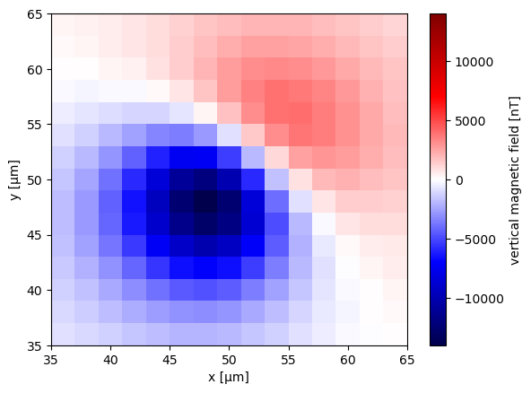Espaçamento: $2 \mu m$

===============================================================================

- Definimos dois cenários sintéticos com diferentes resoluções de malha ($\Delta \in [0.3, 2.0]~\mu\text{m}$):

1. **Modelo Simples:** Um único dipolo isolado

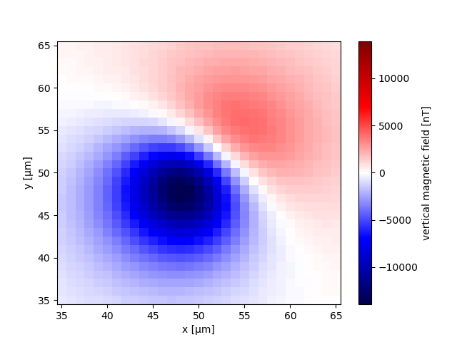 Espaçamento: $1 \mu m$

===============================================================================

- Definimos dois cenários sintéticos com diferentes resoluções de malha ($\Delta \in [0.3, 2.0]~\mu\text{m}$):

1. **Modelo Simples:** Um único dipolo isolado

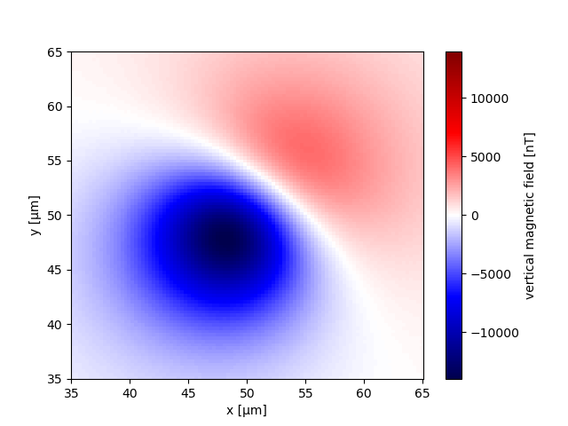 Espaçamento: $0.3 \mu m$

===============================================================================

- Definimos dois cenários sintéticos com diferentes resoluções de malha ($\Delta \in [0.3, 2.0]~\mu\text{m}$):

1. **Modelo "Simple":** Um único dipolo isolado

2. **Modelo "1-Interf.":** Um dipolo alvo + uma fonte interferente próxima

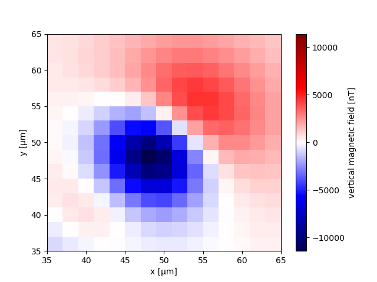 Espaçamento: $2 \mu m$

===============================================================================

- Definimos dois cenários sintéticos com diferentes resoluções de malha ($\Delta \in [0.3, 2.0]~\mu\text{m}$):

1. **Modelo "Simple":** Um único dipolo isolado

2. **Modelo "1-Interf.":** Um dipolo alvo + uma fonte interferente próxima

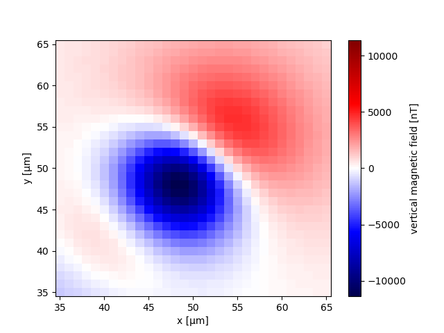Espaçamento: $1 \mu m$

===============================================================================

- Definimos dois cenários sintéticos com diferentes resoluções de malha ($\Delta \in [0.3, 2.0]~\mu\text{m}$):

1. **Modelo "Simple":** Um único dipolo isolado

2. **Modelo "1-Interf.":** Um dipolo alvo + uma fonte interferente próxima

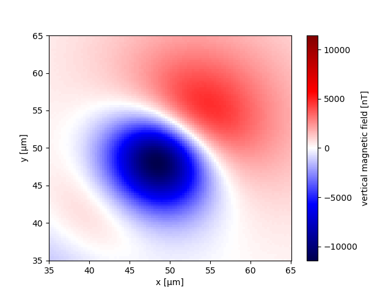Espaçamento: $0.3 \mu m$

===============================================================================

- **Simple:** 

  - **Souza Júnior (2025):** mantém um erro quase constante, menor que do **Magali** e abaixo de **0,5 μm**
  
  - **Magali:** **estabiliza** em um erro pouco acima de **0,5 μm** para altas densidades de pontos

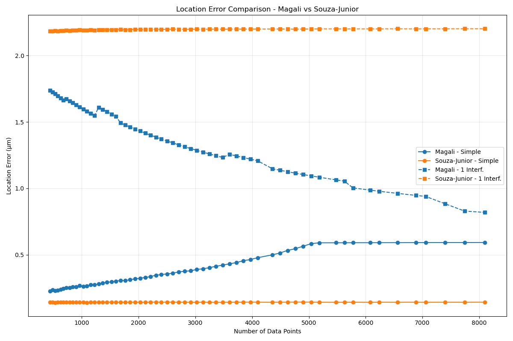

===============================================================================

- **1-Interf.:** 

  - **Souza Júnior (2025):** mantém um erro quase constante pouco acima de **2 μm** 
 
  - **Magali:** melhora com o aumento de $N$, atingindo valores menores que **1 μm**

===============================================================================

- **Simple:** Magali apresenta um erro de intensidade menor em comparação a Souza Júnior (2025) e é de ~1 $Am^2$

- **1-Interf.:** Souza-Junior (2025) apresenta um erro de intensidade menor em comparação ao do Magali e é de ~5 $Am^2$ enquanto Magali é de ~0.6 $Am^2$

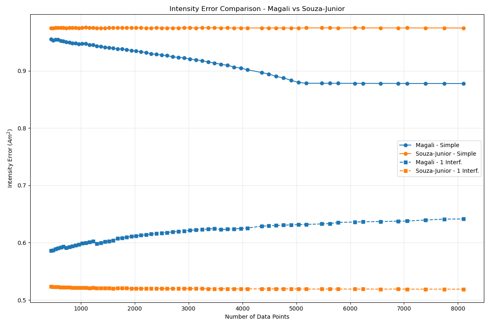

===============================================================================

- **Souza Júnior (2025):** tempo de execução **cresce linearmente** com o aumento do númeo de dados ($N$).

- **Magali:** mantém tempos de execução estáveis e abaixo de **0,5 segundos**.

===============================================================================

- **1-Interf.:** melhoria de aproximadamente **90%** para todos os números de dados

- **Simple:** Melhoria quase sempre maior que **60%** superando **90%** em cenários com mais de **5.000 pontos**

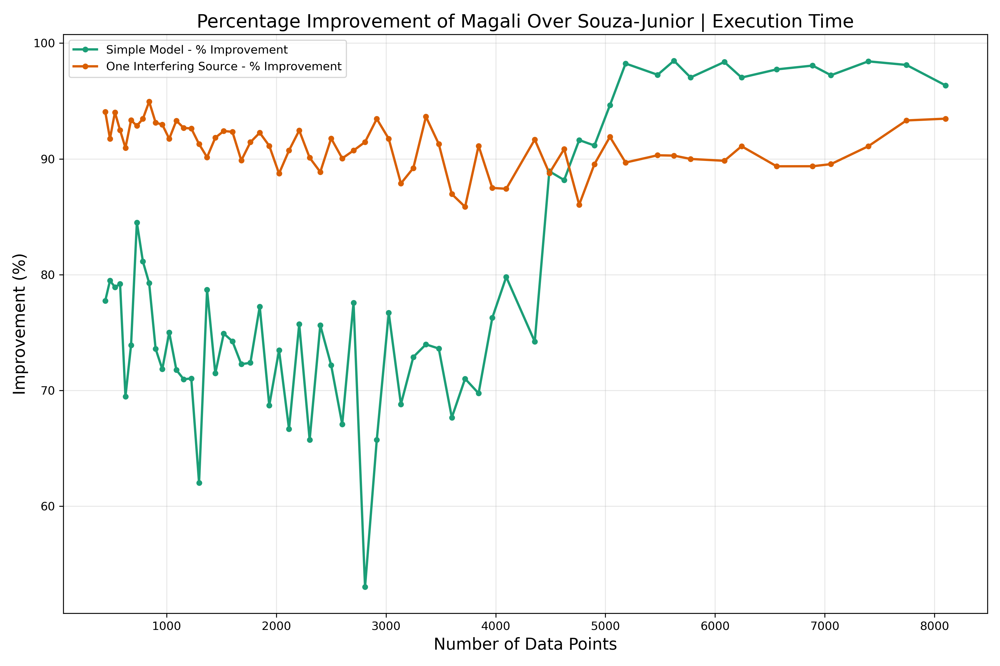

===============================================================================

- **Simple:**
  - **Souza-Junior (2025):** é constante a **~1 grau**

  - **Magali:** inicia a valor similar ao de Souza-Junior (2025) e decai levemente conforme a densidade de pontos aumenta

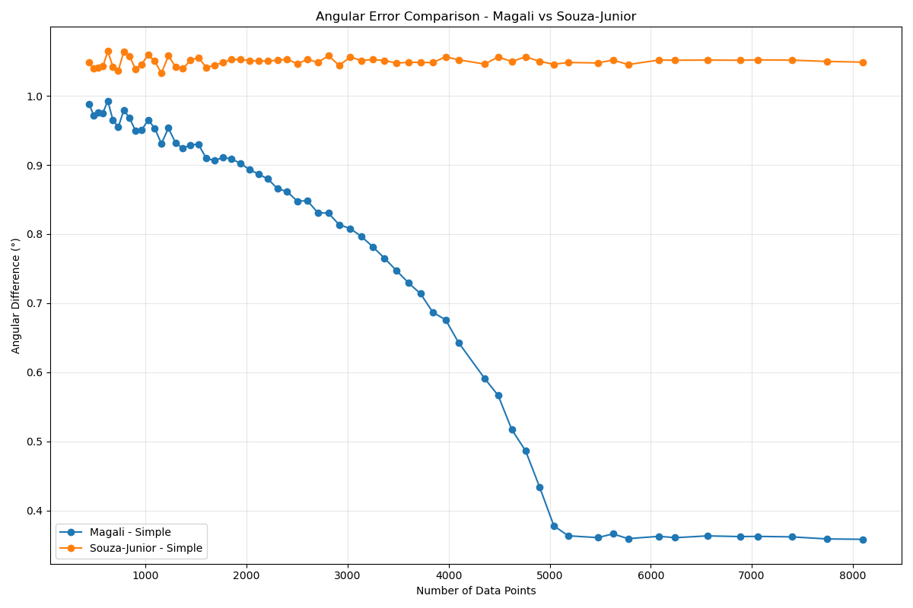

===============================================================================

- **1-Interf.:**
  - **Souza Júnior (2025):**  permanece praticamente constante aa **12 graus**, independentemente do volume de dados

  - **Magali:** diminui conforme $N$ aumenta em ambos os cenários, se aproximando a **6 graus**

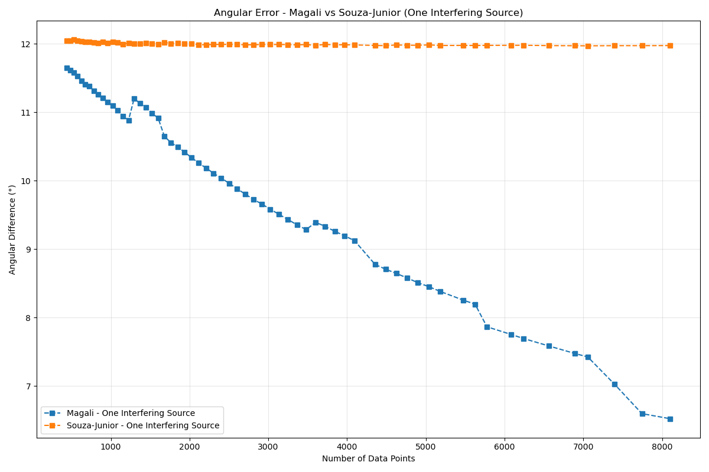

===============================================================================

- **Simple:** cresce conforme o número de pontos aumenta e estabiliza acima de **60%**

- **1-Interf.:** cresce conforme o número de pontos aumenta, atingindo valor **~45%**

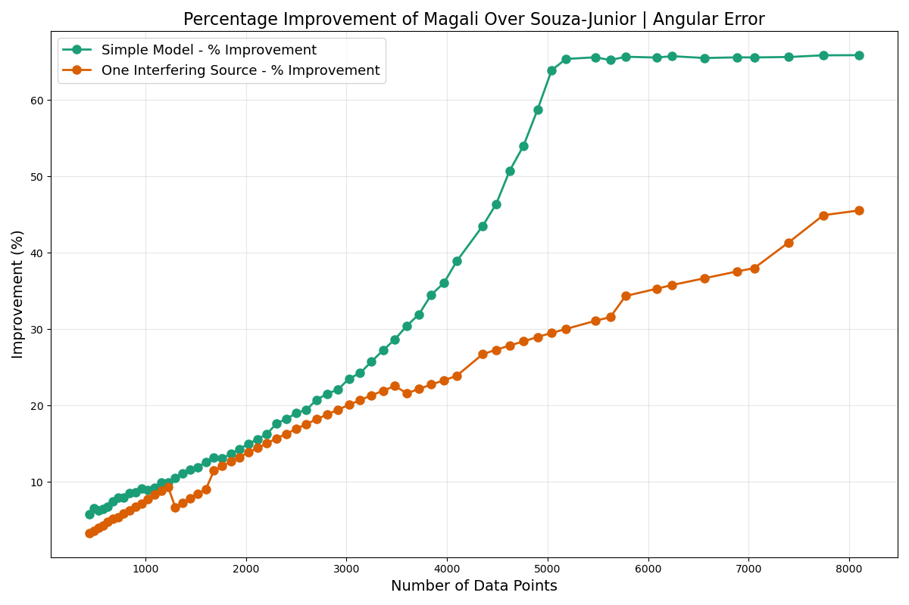

===============================================================================
# Sumário

<ul style="list-style: none">
  <li><b>Paleomagnetismo</b></li>
  <li><b>Microscopia magnética</b></li>
  <li>
    <b>Métodos</b>
    <ul style="list-style: none">
      <li>Análise do Fluxo de Trabalho</li>
      <li>Fundamentação Teórica</li>
      <li>Desenvolvimento de software</li>
    </ul>
  </li>
  <li><b>Comparação de Performance e Acurácia</b></li>  
  <li  style="color: red !important;"><b>Demonstração em dados reais de microscopia magnética</b></li>
  <li><b>Conclusões</b></li>
</ul>

===============================================================================

<section>

<pre class="compact"><code class="python" data-trim data-noescape>
  import magali as mg
  import numpy as np
  import matplotlib.pyplot as plt
  import skimage.exposure
  import ensaio
  import harmonica as hm
</code></pre>
</section>

===============================================================================

<section>

<pre class="compact"><code class="python" data-trim data-noescape>
data_paths = {
    # Use the Ensaio package to fetch the speleothem dataset from the internet
    "speleothem": ensaio.fetch_morroco_speleothem_qdm(
        version=1,
        file_format="matlab",
    ),
    "ceramic": "data/ceramic/NRM1.mat",
    "basalt": "data/basalt/NRM1.mat",
}
</code></pre>
</section>

===============================================================================
<section>

<pre class="compact"><code class="txt" data-trim data-noescape>
xarray.DataArray 'bz' (y: 600, x: 960)> Size: 5MB
array([[ 352.40587477,   94.8913792 ,   41.61924299, ...,  470.18833933,
         129.20055397,   18.50120941],
       [ 525.04809649,  624.84659897,   53.45418   , ...,  450.42515609,
         240.12455308,  -73.61367693],
       [ 105.0939369 ,  638.76559489,  307.60736872, ...,  236.91326522,
         386.8498122 ,  -86.44215589],
       ...,
       [ -83.74367957,   32.98078244, -411.75073652, ...,  745.99373583,
        1036.20033954, -140.64317643],
       [ 171.17113661, -214.47801235,  159.23437984, ...,  124.58138395,
         258.54331931,  -90.3376945 ],
       [  80.60950354,  273.08367487,  118.23499313, ...,   -4.19572521,
         -53.55728012,    2.10335918]])
Coordinates:
  * x        (x) float64 8kB 0.0 2.35 4.7 7.05 ... 2.249e+03 2.251e+03 2.254e+03
  * y        (y) float64 5kB 0.0 2.35 4.7 7.05 ... 1.403e+03 1.405e+03 1.408e+03
    z        (y, x) float64 5MB 5.0 5.0 5.0 5.0 5.0 5.0 ... 5.0 5.0 5.0 5.0 5.0
Attributes:
    long_name:  vertical magnetic field
    units:      nT
</code></pre>
</section>

===============================================================================

<section>

<pre class="compact"><code class="python" data-trim data-noescape>

# Repeat the processing for each dataset but using slightly different parameters
size_ranges = {"speleothem": [20, 150], "ceramic": [10, 150], "basalt": [10, 30]}
detection_thresholds = {"speleothem": 0.02, "ceramic": 0.02, "basalt": 0.002}
datasets, locations, dipole_moments, bounding_boxes = {}, {}, {}, {}
</code></pre>
</section>

===============================================================================

<section>

<pre class="compact"><code class="python" data-trim data-noescape>

for name in ["speleothem", "ceramic", "basalt"]:
    # Use Magali to load the data from Harvard's QDM Matlab file format
    datasets[name] = mg.read_qdm_harvard(data_paths[name])
    # Upward continue the data by 5 microns using the Harmonica package
    height_difference = 5
    data_up = (
        hm.upward_continuation(datasets[name], height_difference)
        .assign_attrs(datasets[name].attrs)
        .assign_coords(x=datasets[name].x, y=datasets[name].y)
        .assign_coords(z=datasets[name].z + height_difference)
        .rename("bz")
    )
    # Calculate data derivatives and TGA
    data_tga = mg.total_gradient_amplitude_grid(data_up)
    # Stretch the TGA contrast to highlight weak sources
    data_stretched = skimage.exposure.rescale_intensity(
        data_tga,
        in_range=tuple(np.percentile(data_tga, (1, 99))),
    )
</code></pre>
</section>

===============================================================================
<section>

<pre class="compact"><code class="python" data-trim data-noescape>

    # Use the LoG to detect the sources in the stretched TGA
    bounding_boxes[name] = mg.detect_anomalies(
        data_stretched,
        size_range=size_ranges[name],  # μm
        detection_threshold=detection_thresholds[name],
        border_exclusion=2,
    )
    # Run the non-linear inversion to estimate dipole moments and locations
    results = mg.iterative_nonlinear_inversion(
        data_up, bounding_boxes[name], copy_data=True
    )
    locations[name] = results[1]
    dipole_moments[name] = results[2]
</code></pre>
</section>

===============================================================================
# Estalagmite
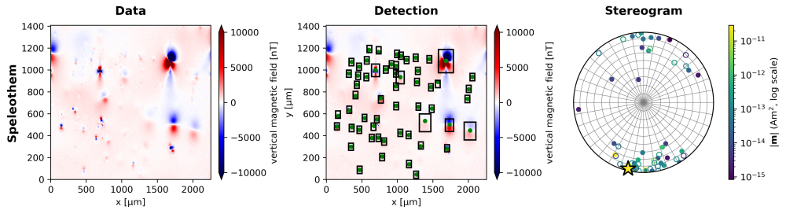

- **57 possíveis fontes** detectadas
- **Mineralogia e pulsos:** diferenciação de **hematita** (+Y) e **magnetita** (-Y) através de campos de pulso IRM (2.7 T e 0.3 T)

- **Poucas anomalias** quando comparado a outros datasets

- **Baixa dispersão** de momentos estimados

[Carmo et al 2023](https://figshare.com/articles/dataset/QDM_magnetic_microscopy_dataset_of_a_speleothem_from_Morocco/22965200/1?file=40707380)

===============================================================================
# Fragmento de ladrilho cerâmico
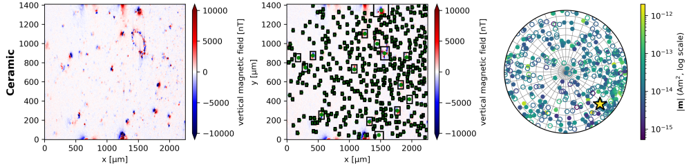

- **397 posíveis  fontes** detectadas
  
- **Mineralogia:** **titanomagnetita** (SD/PSD) portadora da NRM em **assembleia estável e dispersa**

- Número de fontes **consideravelmente maior** que do espeleotema
- Momentos estimados **razoavelmente concentados**

[Poletti et. al 2016](https://www.sciencedirect.com/science/article/pii/S0012821X16301625)

===============================================================================
# Rocha Basáltica
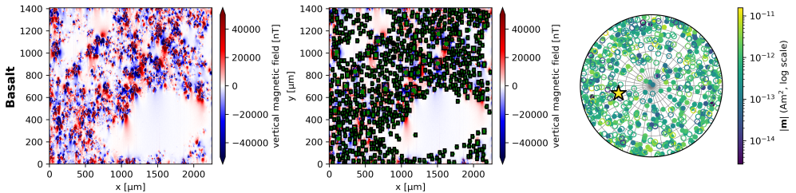

- **661 possíveis fontes** encontradas
- **Mineralogia:** **magnetita** de baixo Ti ($10-50$ µm) com grãos SD, PSD e multidomínio (MD)</li>

- Região com **alta concentração** de anomalias sobrepostas
- Momentos magnéticos estimados com **alta dispersão**

[Souza-Junior et al 2025](https://eartharxiv.org/repository/view/8869/)

===============================================================================
# Sumário

<ul style="list-style: none">
  <li><b>Paleomagnetismo</b></li>
  <li><b>Microscopia magnética</b></li>
  <li>
    <b>Métodos</b>
    <ul style="list-style: none">
      <li>Fundamentação Teórica</li>
      <li>Desenvolvimento de software</li>
    </ul>
  </li>
  <li><b>Comparação de Performance e Acurácia</b></li>  
  <li><b>Demonstração em dados reais de microscopia magnética</b></li>
  <li style="color: red !important;"><b>Conclusões</b></li>
</ul>

===============================================================================
# Contribuições Metodológicas

- Consolidamos um **fluxo completo de inversão** (detecção, Euler e refinamento) em um pacote unificado, extensível e de código aberto

- Otimizamos a inversão não-linear através da **estratégia híbrida** com o algoritmo de **Levenberg-Marquardt**, utilizando derivadas analíticas do modelo direto

- Eliminamos problemas de escalonamento numérico e instabilidade ao **desacoplar os parâmetros** de momento dipolar (linear) e posição (não-linear)

===============================================================================
# Benchmarking

- Alcançamos **ganhos de eficiência superiores a 90%** em comparação ao método de referência (Souza-Junior et al., 2025). O tempo de execução mostrou-se **insensível à densidade de dados**, mantendo-se em níveis **abaixo de 1 segundo**

- Elevamos a **precisão** em cenários complexos (fontes interferentes):
  * Redução de **60% no erro angular** para o modelo simples
  * Redução de **40% no erro angular** no caso de fonte interferente

===============================================================================
# Ciência Aberta

- **Democratizaremos** o acesso a ferramentas de ponta para a comunidade de paleomagnetistas, reduzindo barreiras técnicas via **PyPI** e **conda-forge**

- Mitigamos o isolamento metodológico através de **desenvolvimento transparente, testes automatizados e documentação** para novos usuários

===============================================================================
# Trabalhos Futuros

- Projetamos para o futuro do Magali:

  

  - Implementação de **expansão multipolar**

  

  

  - Módulos de **projeção estereográfica** e **filtragem** de inversão

  

  

  - Rotinas avançadas para **detecção automática** de fontes

  

  

  - Incluir Magali no **conda-forge** e **PyPi**

  

  

  - Melhorias na documentação

  

  

  - Release V1.0

  

    

  - Difundir o uso da biblioteca

  

===============================================================================

**Magali** une **rigor matemático** e **ciência aberta** para consolidar o **paleomagnetismo de escala de grão** como uma técnica rápida, acessível e totalmente reproduzível

===============================================================================
# Agradecimentos

===============================================================================
<!-- .slide: data-background-opacity="0.2" data-background-image="assets/magali-logo.png"  data-background-size="contain" data-background-color="#262626" -->
# Obrigado!

<i class="fas fa-comments"></i>
 
Contato:
<a>yagomcastro1@gmail.com</a>

<i class="fab fa-github"></i>
 
Código-fonte desta apresentação:
 
[github.com/yagomcastro/msc-presentation-2026](https://github.com/yagomcastro/msc-presentation-2026)

<i class="fab fa-creative-commons"></i><i class="fab fa-creative-commons-by"></i>
 
O conteúdo desta apresentação está licenciado sob a
 
[Creative Commons Attribution 4.0 International License](https://creativecommons.org/licenses/by/4.0/)

[github.com/fatiando/magali](https://github.com/fatiando/magali)

